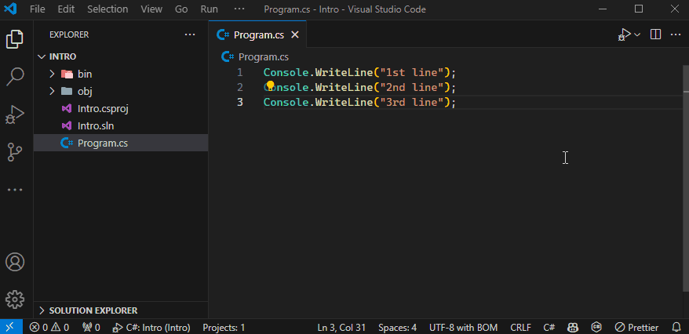
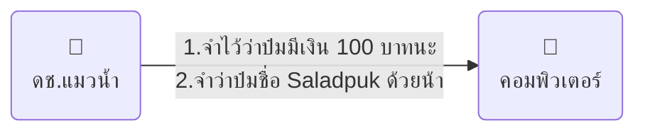
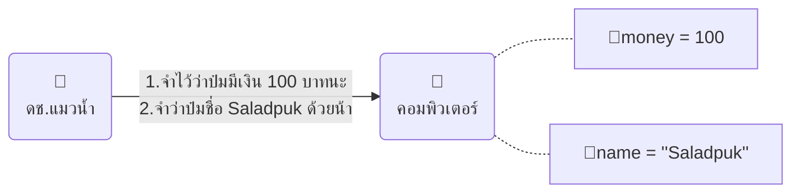
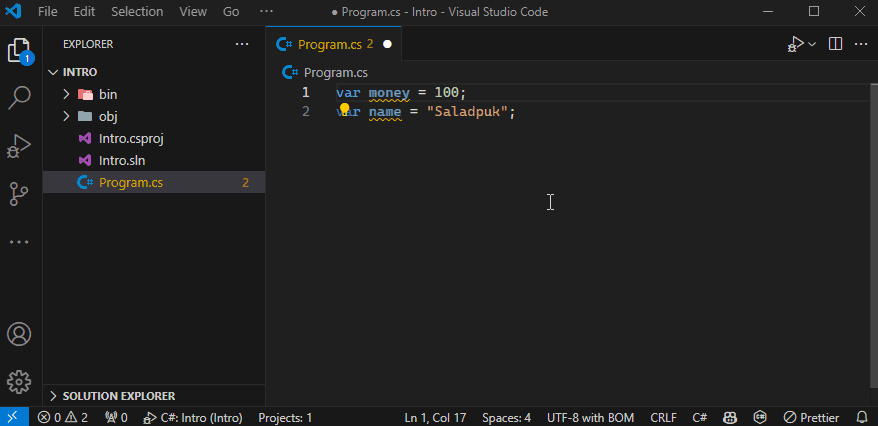
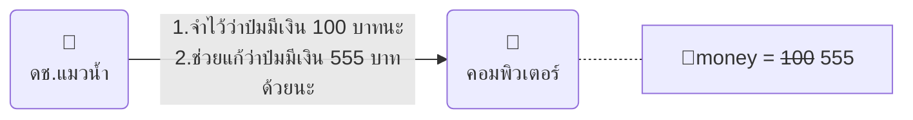
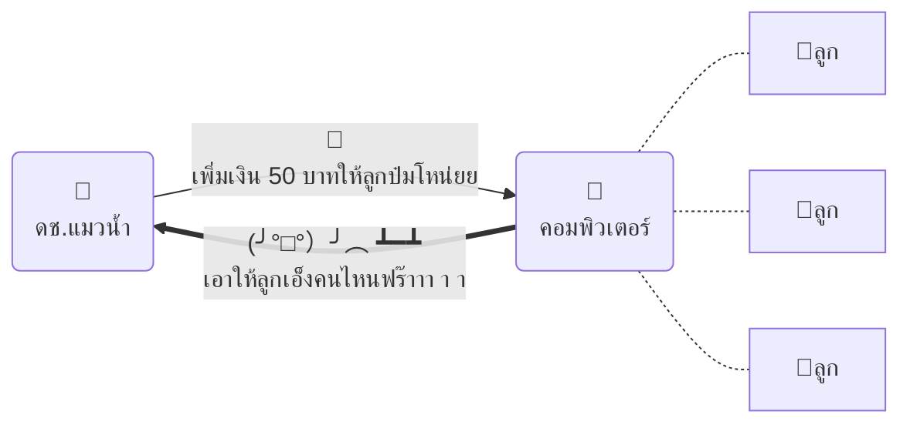
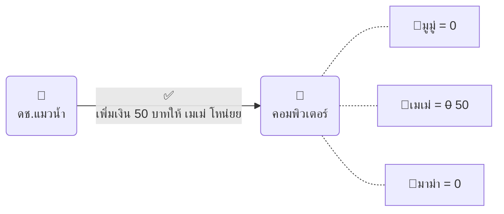

# การเล่นกับโค้ด

🤔เขียนโค้ดใหม่ๆต้องรู้อะไรบ้าง? โค้ดมันทำงานยังไง? จะเขียนโค้ดได้ต้องคิดยังไง? **ดช.แมวน้ำ** มีคำตอบให้กั๊ฟป๋ม


> ภาพจาก [Microsoft Copilot](https://th.bing.com/th/id/OIG3.ckfjwLDyrRXxpEdTUe6Y)

---

<PartialExample name="shared" />
import PartialExample from './_shared.md';

## 👶ความรู้พื้นฐาน
หลังจากที่เราได้หัดเริ่มเขียนโค้ดจากบทความ <Yellow>[เขียนโค้ดครั้งแรก](/docs/code/procedural/install)</Yellow> กันไปแย้ว คราวนี้เราจะมา `🔍ซูมดูการทำงานพื้นฐานของโค้ดกัน` โดยให้เปิดไฟล์ <Gray>Program.cs</Gray> แล้วก๊อปปี้โค้ดด้านล่างไปวางแทนที่โค้ดเดิมได้เรย

```csharp showLineNumbers title="Program.cs"
Console.WriteLine("1st line");
Console.WriteLine("2nd line");
Console.WriteLine("3rd line");
```

เมื่อเรารันโค้ดด้านบน เราจะเห็นข้อความออกมาบนหน้าจอ ตามด้านล่าง

<Blue>**1st line**</Blue>  
<Blue>**2nd line**</Blue>  
<Blue>**3rd line**</Blue>  

นั่นแสดงว่า <Green>คอมจะรันโค้ดไปทีละบรรทัด จากบนลงล่างตามลำดับ</Green>

**🤨 มั่วป่าว? จะพิสูจน์เรื่องนี้ยังไง?**  
ใจเย็นๆนะโยม o(TヘTo) ... เพื่อให้ป๋ม ~~เถียง~~ พิสูจน์เรื่องนี้ เราจะสั่งเจ้า VS Code ให้มันค่อยๆทำงานแบบช้าๆ เพื่อดูว่าโค้ดมันถูกเอาไปทำงานยังไงทีละขั้นตอน โดยทำตามด้านล่างนี้เยย
    1. ใน VS Code เปิดไฟล์ <Gray>Program.cs</Gray> ขึ้นมา แล้วให้ Cursor ไปอยู่บรรทัดที่ 1
    1. ที่เมนูด้านบนให้กด `Run > Toggle Breakpoint` แล้วเราจะเห็นมันมีจุดแดงๆ 🔴 โผล่ขึ้นมาหน้าเลขบรรทัด
    1. ที่เมนูด้านบนให้กด `Run > Start Debugging` แล้วรอสักครู่โปรแกรมจะเริ่มทำงานแล้ว <Gray>หยุดตรงบรรทัดที่มีจุดแดง 🔴</Gray>
        > นี่คือการให้โปรแกรมค่อยๆทำงานแบบช้าๆให้เราดู โดยมันจะ <Yellow>ไฮไลท์สีเหลืองเพื่อบอกว่าเดี๋ยวฉันเอาโค้ดตรงนี้ไปทำงานนะ</Yellow> ซึ่งตามโค้ดของเรามันควรจะไฮไลท์บรรทัดที่เขียนว่า <Gray>Console.WriteLine("1st line");</Gray>
    1. เมื่อเข้าสู่โหมดทำงานแบบช้าๆแล้ว โปรแกรมจะรอให้เรากดเพื่อให้เราค่อยๆไปต่อทีละขั้นตอน โดยจะมีเมนูควบคุมโผล่ขึ้นมาด้านบน ซึ่งเราจะกดที่ปุ่ม <Gray>Step Over</Gray> **เพื่อสั่งให้โปรแกรมทำงานโค้ดตัวถัดไป**
        > * **ก่อนที่เราจะกด Step Over** → ให้ลองดูหน้าต่าง <Gray>TERMINAL</Gray> ด้านล่าง จะเห็นว่ามันจะไม่ได้พิมพ์ข้อความใดๆออกมา เพราะไฮไลท์ที่เหลืองตรงบรรทัดที่ 1 มันบอกว่า เดี๋ยวจะทำ แต่ยังไม่ได้ทำงุย 😘
        > * **เมื่อเรากดปุ่ม Step Over (ครั้งแรก)** → จะเห็นว่ามันพิมพ์คำว่า <Blue>**1st line**</Blue> ออกมา พร้อมกับไปไฮไลท์บรรทัดที่ 2 เพื่อบอกว่าฉันกำลังจะทำตรงนี้ต่อนะ แล้วมันจะหยุดรอเราเหมือนเดิม
        > * **เมื่อเรากดปุ่ม Step Over (ครั้งสอง)** → จะเห็นว่ามันพิมพ์คำว่า <Blue>**2nd line**</Blue> ออกมา พร้อมกับไปไฮไลท์บรรทัดที่ 3 ซึ่งจากตรงนี้เพื่อนๆก็ลองกดเล่นต่อได้เรื่อยๆเลย
    
    
    
จากขั้นตอนทั้งหมดนี้ จะเป็นการพิสูจน์ได้แล้วว่า โค้ดที่เราเขียนนั้นจะถูกทำงานจากบนลงล่างตามลำดับไปเรื่อยๆงุยล่าาาา 😉

การสั่งให้คอมทำงานแบบช้าๆแบบในตัวอย่างด้านบนนี้ ในภาษาเดฟเราเรียกมันว่าการ <Green>Debug</Green> (อ่านว่า `ดีบัค`) ซึ่งส่วนใหญ่เราจะใช้ในการตรวจโค้ดเวลาที่มันทำงานผิดปรกติ หรือ มันทำงานไม่เหมือนกับที่เราคิดเอาไว้ เพื่อหาว่าจุดไหนที่เราเขียนโค้ดผิดนั่นเอง ซึ่งเดี๋ยวเราจะค่อยๆมาเรียนรู้การใช้ debug แบบลึกขึ้นในบทถัดๆไปนะ ...อ๋อ **ต่อไปนี้ป๋มจะเรียกมันว่า Debug** แย้วนะกั๊ฟ 😆

## 🧙‍♂️การสั่งคอมทำงาน
หลังจากที่เรารู้แล้วว่า <Gray>คอมมันทำงานทีละคำสั่ง</Gray> แล้วเราสงสัยกันมะว่า **🤨คอมมันรู้ได้ไงว่าที่เราพิมพ์ๆมันมีกี่คำสั่งกัน?** ...คำตอบก็คือ <Green>1 คำสั่งของภาษา C# จะต้องจบด้วยเครื่องหมายเซมิโคล่อนเสมอ</Green> นั่นหมายความว่า ถ้าเราเห็นเครื่องหมาย `;` อยู่ 5 ตัว ก็แสดงว่ามี 5 คำสั่งนั่นเองงับ

เพื่อเป็นการพิสูจน์ เราลองเล่นซนโดยจัดเรียงโค้ดใหม่ให้เป็นแบบด้านล่าง

```csharp showLineNumbers title="Program.cs"
Console.WriteLine("1st line");    Console.WriteLine("2nd line");

         Console.WriteLine("3rd line");
```

ซึ่งเมื่อเราลองเอาโค้ดด้านบนไปรันก็พบว่า ผลลัพท์ที่ได้มันเหมือนกับก่อนหน้าที่จะถูกจัดเรียงใหม่ ตามด้านล่างเลย

<Blue>**1st line**</Blue>  
<Blue>**2nd line**</Blue>  
<Blue>**3rd line**</Blue>  

นั่นก็หมายความว่า คอมมันแยกคำสั่งต่างๆได้จากเครื่องหมาย `;` โดยไม่ได้สนใจการจัดวางของโค้ดเลย ซึ่งก็สามารถพูดอีกด้านหนึ่งได้ว่า <Red>ถ้าเราใส่ semi-colon ผิด หรือลืมใส่ คอมจะทำงานไม่ได้เลย 💀</Red> ดังนั้นเราลองพิสูจน์เรื่องนี้กันโดยแก้โค้ดโดยเอา semi-colon ออกแบบด้านล่าง เราก็จะพบว่าโปรแกรมมันไม่สามารถทำงานได้นั่นเองฮั๊ฟ

```csharp showLineNumbers title="Program.cs"
Console.WriteLine("1st line") // ERROR: มันหาเครื่องหมาย ; ไม่เจอ
```

:::tip[เกร็ดความรู้]
1 คำสั่งในภาษา C# เราเรียกมันว่า <Green>1 Statement</Green> (อ่านว่า `สเตดเม้นท์`) โดยทุกๆ statement จะต้องจบด้วยเครื่องหมาย `;` เสมองับ
:::


## 🧠สั่งให้คอมจำข้อมูล
การที่เราจะบอกให้คอมทำอะไรก็ตาม เราจะต้อง <Gray>ส่งคำสั่งไปให้คอมทำ—ทีละคำสั่ง</Gray> โดยป๋มจะพาเพื่อนๆสั่งให้คอมมันจำข้อมูลไว้ในหัว 2 อย่าง ตามด้านล่างนี้เยย



**🤔 สั่งให้มันจำทำไง?**  
การสั่งให้คอมมันจำอะไรก็ตาม <Gray>เราต้องตั้งชื่อสิ่งที่จะให้มันจำก่อน</Gray> **เพื่อให้เรากับคอมรู้กันว่าสิ่งที่มันจำนั้นชื่ออะไรนั่นเอง** โดยในตัวอย่างนี้ ป๋มจะตั้งชื่อของต่างๆตามด้านล่างนี้

    * **money** → เป็นชื่อที่ให้คอมจำว่าป๋มมีเงินอยู่ 100 บาท
    * **name** → เป็นชื่อที่ให้คอมจำว่าป๋มมีชื่อ Saladpuk

หลังจากตั้งชื่อแล้ว ป๋มก็จะเขียนโค้ดง่ายๆลงไปตามด้านล่าง ซึ่งจะทำให้คอมมันจำข้อมูลต่างๆได้แย้ว

```csharp showLineNumbers title="Program.cs"
var money = 100;
var name = "Saladpuk";
```



**🤔 รันแล้วไม่เห็นมีอะไรเลย รู้ได้ไงว่ามันจำแล้ว?**  
นั่นจินะ (ツ) ...อย่าเชื่อในสิ่งที่แมวน้ำเล่าให้ฟังแต่จงพิสูจน์!! โดยการรันโค้ดด้วย debug mode แล้วเราจะเห็นข้อมูลทุกอย่างที่คอมมันจำเอาไว้ ซึ่งดูได้ที่หมวด <Gray>VARIABLES</Gray> ดูตัวอย่างได้จากคลิปด้านล่าง

:::tip[เกร็ดความรู้]
* เราสามารถใส่ <Gray>🔴Breakpoint</Gray> ได้จากการเอาเมาส์ไปวางไว้หน้าเลขบรรทัด แล้วกดคลิกซ้ายได้ด้วยนะจ๊ะ
* เราสามารถรัน debug mode ได้จากเมนูด้านซ้าย <Gray>Run and Debug</Gray> แล้วกดปุ่ม <Icon color="green" icon="fa-solid fa-play" /> ได้เยย
:::



จะเห็นว่าเมื่อเราทำการสั่ง **Step Over** ในบรรทัดแรกเสร็จปุ๊ป ค่า `money` ก็จะถูกเปลี่ยนเป็น 100 ทันที นั่นแสดงว่าคอมมันทำการจำข้อมูลที่เราสั่งไปแล้วนั่นเอง เย่ 🎉

:::note[หมายเหตุ]
เมื่อเพื่อนๆกด **Step Over** ครั้งที่ 2 เพื่อที่จะดูค่า `name` จะเห็นว่าโปรแกรมมันจบการทำงานลงไปดื้อๆเลย นั่นเป็นเพราะเราเขียนไว้แค่ 2 บรรทัด และเมื่อมันทำบรรทัดที่ 2 เสร็จ **โดยปรกติโปรแกรมจะปิดตัวเองลงเมื่อมันไม่มีคำสั่งอื่นต่อแล้วนั่นเอง** ซึ่งถ้าเพื่อนๆอยากเห็นค่า `name` ก็ให้ทำการเขียนโค้ดเพิ่มเข้าไปต่อ แล้วรัน debug ใหม่นะจ๊ะ 😆
:::

**🤔 จะให้มันจำไปทำไม?**  
เหมือนมันจะไร้สาระเลยชิมิ (╯▔皿▔)╯ ...การสั่งให้คอมมันจำนี้เป็นพื้นฐานที่สำคัญและใช้บ่อยม๊วกๆเลยนะ เช่น เราให้มันจำว่าจะให้มันทำงานตอนกี่โมง, จะให้มันส่งอีเมล์หาใครบ้าง, จะแจ้งเตือนเมื่อเงินเกิน x บาท บลาๆ ซึ่ง **ดช.แมวน้ำ** ขอบอกว่าเราแทบจะเขียนโค้ดไม่ได้เลยถ้าไม่สั่งให้มันจำข้อมูลไว้นั่นเอง 😏

**🤔 จะเปลี่ยนให้มันจำค่าใหม่ทำไง?**  
ถ้าเราเคยสั่งให้มันจำค่าไปแล้วครั้งหนึ่ง แล้วต้องการเปลี่ยนให้มันจำเป็นค่าอื่นแทนค่าเดิม **เราสามารถกำหนดค่าใหม่โดยอ้างชื่อที่เราตั้งไว้ได้เลย** เช่น เคยจำว่าป๋มมีเงิน 100 บาท แล้วต้องการเปลี่ยนให้มันจำเป็น 555 บาท ก็จะเขียนได้ตามด้านล่างนี้



```csharp showLineNumbers title="Program.cs"
var money = 100;
money = 555;
```

เพื่อทดสอบว่าคอมมันจำค่าใหม่จริงหรือเปล่า โดยจะลองรันด้วย debug mode เหมือนเดิมก็ได้ แต่มันมีวิธีเช็คที่ง่ายกว่านั้นอีกนั่นคือการ <Gray>สั่งคอมให้เอาค่าที่จำไว้มาโชว์ให้ดูเยย</Gray> จากคำสั่ง `Console.WriteLine` โดยเพิ่มโค้ดที่ไฮไลท์ตามด้านล่างนี้ลงไป

```csharp showLineNumbers title="Program.cs" {3}
var money = 100;
money = 555;
Console.WriteLine(money);
```

เมื่อลองรันโค้ดด้านบนดูก็จะพบว่ามันพิมพ์เลข <Blue>555</Blue> ออกทางหน้าจอ นั่นก็แสดงว่าเราสามารถแก้ไขให้มันจำค่าใหม่ๆได้นั่นเองขอรับ 😋

**🤔 ทำไมบางทีใส่ var บางทีไม่ใส่?**  
~~ถ้าไม่ใส่ก็จะสบายตัว นั่นมันบรา!! (づ￣ 3￣)づ~~ เราจะเห็นคำสั่งใหม่ที่เขียนว่า <Gray>var</Gray> ในโค้ดล่าสุด ซึ่งเจ้าคำสั่งนี้มันมีหน้าที่บอกให้คอมของเรารู้ว่า <Green>ตรงนี้คือคำสั่งในการตั้งชื่อนะ</Green> **ดังนั้นเมื่อเราใช้คำสั่ง var แล้วเราจะต้องทำการกำหนดชื่อให้คอมมันจำทันที** โดยมีรูปแบบตามด้านล่าง

```csharp
var ชื่อที่เราจะตั้ง = ค่าที่เราจะให้มันจำ;
```

เช่น เราจะให้มันจำค่า 3 อย่างคือ เงิน, เลเวล, เกรดเฉลี่ย ก็จะเขียนได้ตามด้านล่างนี้
```csharp
var money = 777;
var level = 99;
var gpa = 3.99;
```

ซึ่งคำสั่งตั้งชื่อนี้จะใช้ก็ต่อเมื่อ <Gray>เป็นการตั้งชื่อที่ไม่เคยมีมาก่อน</Gray> เช่น คอมยังไม่รู้จักชื่อ `money` ดังนั้นเราจะต้องใส่เป็น `var` ลงไป แต่ในทางกลับกัน <Red>จะไม่สามารถใส่ var ลงไปได้</Red> **ถ้าคอมรู้จักหรือเคยมีชื่อนั้นๆมาก่อนแล้ว** เช่นตัวอย่างด้านล่างนี้ไม่สามารถทำได้

```csharp showLineNumbers
var money = 777;
var money = 888; // ❌ ใส่ var ไม่ได้ เพราะคอมรู้จักชื่อนี้แล้วจากบรรทัดที่ 1 ไปแล้ว
money = 999;     // ✅ สามารถกำหนดค่าให้ money ได้ เพราะมันรู้จักชื่อนี้แล้ว
```

**🤔 ทำไมต้องตั้งชื่อด้วย?**  
สมมุติว่าตอนนี้คอมรู้ว่าป๋มมีลูก 3 คน แล้วผมสั่งคอมไปว่า เฮ้รบกวนเพิ่มเงิน 50 บาทให้ลูกป๋มหน่อยนะ คิดว่าคอมจะรู้มะว่าต้องเพิ่มเงินให้ลูกคนไหนของป๋ม? ...มันคงจะมองหน้าป๋มแล้วถามว่า **(¬_¬") เอ็งจะเพิ่มเงินให้ลูกคนไหนหล่ะ?** เพราะคอมมันไม่รู้ว่าต้องเอาเงิน 50 บาทไปให้ใครนั่นเอง



เพราะโค้ดจะต้องได้ผลลัพท์เหมือนเดิมทุกครั้งที่ทำงานมันเลยมั่วไม่ได้ ดังนั้นเราเลยต้อง <Gray>ตั้งชื่อเพื่อใช้ในการอ้างอิงกับคอม</Gray> เพื่อบอกคอมว่าลูกทั้ง 3 คนของผมนั้นชื่ออะไร สมมุติว่าเป็น มูมู่, เมเม่, มาม่า ละกันนะ และการเพิ่มเงิน 50 บาทนั้นจะทำการเพิ่มให้ `เมเม่` ซึ่งเพียงเท่านี้คำสั่งของเราก็จะชัดเจนไม่มีความคลุมเครือแย้ว 😆



```csharp showLineNumbers
var มูมู่ = 0;
var เมเม่ = 0;
var มาม่า = 0;
เมเม่ = 50;
```

## 🤖การตั้งชื่อ
จากด้านบนก็จะทำให้เรารู้จัก **การตั้งชื่อ** และ **การกำหนดค่า** แบบง่ายๆไปแล้ว ซึ่งเรื่องนี้ในเดฟเราจะเรียกว่า <Green>การตั้งชื่อตัวแปร</Green> โดยสิ่งที่เราตั้งชื่อไม่ว่าจะเป็น money, name, level หรืออะไรก็ตามแต่ เราเรียกเจ้าพวกนี้แบบเหมารวมว่า <Green>ตัวแปร</Green> หรือในภาษาอังกฤษคือ **Variable** (อ่านว่า `วาริเอเบิล`) นั่นเอง ซึ่งต่อไปนี้ **ดช.แมวน้ำ** จะขอเรียกมันว่า **"ตัวแปร"** นะจ๊ะ ...ซึ่งการ**สร้างตัวแปรนั้นมีกฎต่างๆที่เราจำเป็นต้องรู้**  ดังนี้

**⛔กฎเหล็กของการตั้งชื่อตัวแปร (ฝ่าฝืนไม่ได้)**

1. ห้ามซ้ำกัน
1. ห้ามขึ้นต้นด้วยตัวเลข
1. ห้ามใส่ตัวอักษรพิเศษลงในชื่อ
    * ยกเว้น `_` (underscore) ซึ่งจะใส่ตรงไหนก็ได้
    * ยกเว้น `@` (at sign) ซึ่งจะใส่ได้แค่คำขึ้นต้น
1. ตัวพิมพ์เล็กกับพิมพ์ใหญ่ถือว่าต่างกัน (เราเรียกว่า **case-sensitive**)
1. ห้ามตั้งชื่อซ้ำกับที่ภาษา C# สงวนไว้ (เราเรียกว่าคำสงวน **reserved words**)
    * รายการ Reserved words ทั้งหมดสามารถดูได้จากลิงค์นี้เลยงับ <Yellow><Icon icon="fa-solid fa-earth-americas" /> [C# Keywords](https://learn.microsoft.com/en-us/dotnet/csharp/language-reference/keywords/)</Yellow>

```csharp showLineNumbers title="ตัวอย่าง"
var money;  // ✅ ทำได้
var money;  // ❌ ทำไม่ได้ เพราะซ้ำกับบรรทัดที่ 1 (ผิดกฏข้อ 1)
var 7money; // ❌ ทำไม่ได้ เพราะขึ้นต้นด้วยตัวเลข (ผิดกฏข้อ 2)
var m@ney;  // ❌ ทำไม่ได้ เพราะมีตัวอักษรพิเศษ (ผิดกฏข้อ 3)
var _money; // ✅ ทำได้ เพราะเป็นข้อยกเว้นของกฏข้อ 3
var @money; // ✅ ทำได้ เพราะเป็นข้อยกเว้นของกฏข้อ 3
var Money;  // ✅ ทำได้ ไม่ซ้ำกับบรรทัดที่ 1 เพราะกฏข้อ 4
var class;  // ❌ ทำไม่ได้ เพราะเป็นคำสงวนของภาษา C# (ผิดกฏข้อ 5)
```

<details>
  <summary>⚠️กฏการตั้งชื่อสำหรับมือโปร (จิ้มเพื่อดู)</summary>
  <div>
    <div>
    การฝ่าฝืนกฏพวกนี้ไม่ได้ทำให้โปรแกรมพัง แต่ **การทำตามจะช่วยให้เดฟทำงานได้ง่ายขึ้น** (ในบริษัที่เข้มงวดเรื่องเดฟมากๆจะฝ่าฝืนเรื่องนี้ไม่ได้เลย) ส่วนสำหรับมือใหม่ถ้าเป็นไปได้ **ดช.แมวน้ำ** อยากให้ฝึกรักษากฏพวกนี้ไว้ เพราะมันคือความใส่ใจในการเขียนโค้ด และถ้าเราทำจนเข้าเส้น เราจะทำมันได้เองโดยไม่ได้รู้สึกว่าถูกบังคับจากกฏอีกต่อ แต่เราทำเพราะเรารู้ว่ามันดียยยยยยย์ 😊

    1. ต้องเป็นภาษาอังกฤษที่สื่อความหมายของที่มันเก็บชัดเจน
    1. ต้องไม่คลุมเครือ
    1. ต้องเป็นไปตาม Coding Convention ของบริษัท
        * กฏข้อ 3 นี้จะขึ้นอยู่กับที่บริษัท หรือ ทีมกำหนด เช่น การย่อต้องเป็นตัวพิมพ์ใหญ่ทั้งหมด, private fields & methods ต้องเขียนยังไง, ต้องอ่านออกเสียงได้, การตั้งชื่อจะใช้ camel, pascal, sanke บลาๆ บริษัทที่มี Standard สูงๆจะมีเรื่องนี้ ลองถามพี่ๆในบริษัทดูนะ 😘

        ```csharp showLineNumbers title="ตัวอย่าง"
        var money;            // 🤪 ได้บางกรณีและไม่ได้บางกรณี เพราะมันคลุมเครือ (ผิดกฏข้อ 2)
        var currentUserMoney; // ✅ ทำได้ เพราะชัดเจนและไม่คลุมเครือ
        var m;                // ❌ ทำไม่ได้ เพราะไม่รู้ว่า m คืออะไร (ผิดกฏข้อ 1)
        var เงิน;              // ❌ ทำไม่ได้ เพราะไม่ใช่ภาษาอังกฤษ (ผิดกฏข้อ 1)
        var MoNE_y;          // ❌ ทำไม่ได้ เพราะน่าจะของบริษัท (ผิดกฏข้อ 3)
        ```
    </div>
  </div>
</details>

## 🥳สรุป
จากตรงนี้เราได้เรียนวิธีการรัน debug mode เพื่อดูค่าของตัวแปรในแต่ละขั้นตอน และ รู้วิธีการสร้างตัวแปรพร้อมกำหนดค่าต่างๆกันได้เยียบย้อยแย้ว ซึ่งในบทนี้ **ดช.แมวน้ำ** อยากให้เพื่อนๆ <Gray>ลองเล่นการ debug ให้เยอะๆ</Gray> และ <Gray>ลองสร้างตัวแปรมาเล่นหลายๆแบบ</Gray> เพื่อให้เราเกิดความเข้าใจเรื่องนี้ให้มากขึ้นก่อน แล้วค่อยไปต่อในบทถัดไปนะกั๊ฟ