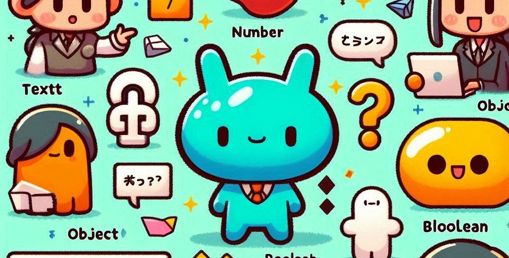
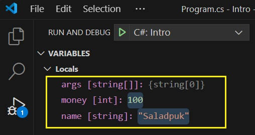
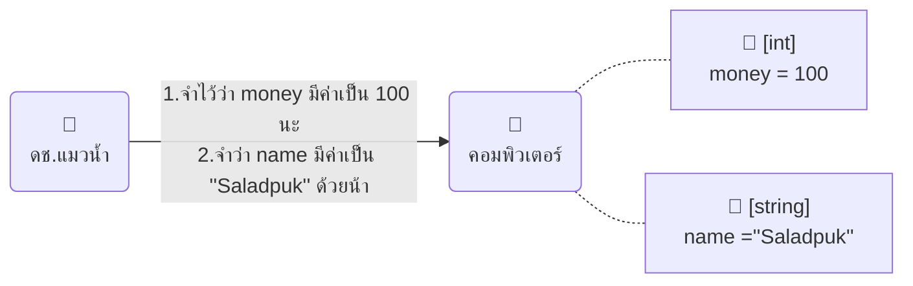
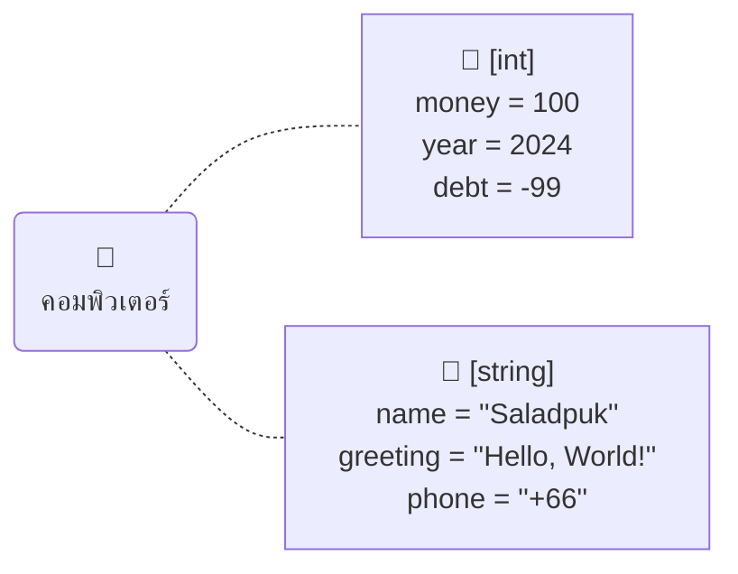
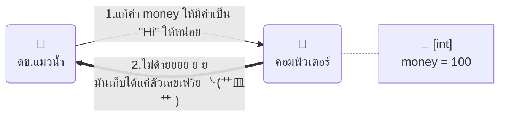
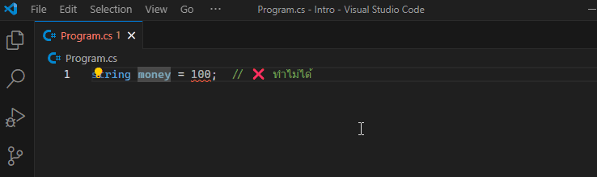
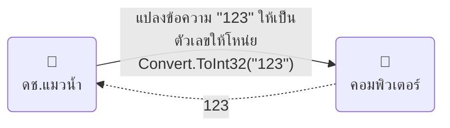
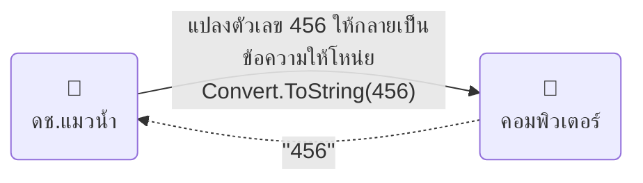

# {frontMatter.title}

<p>{frontMatter.description}</p>



<blockquote>ภาพจาก <a href={frontMatter.image} target="_blank">Microsoft Copilot</a></blockquote>

---

<PartialExample name="shared" />
import PartialExample from './_shared.md';

## 🤨คอมเข้าใจของที่มันจำได้ไง? {#intro}
หลังจากที่เราได้ลองสั่งให้คอมจำข้อมูลแบบง่ายๆจากบทความ <Yellow>[การเล่นกับโค้ด](/docs/code/procedural/concept)</Yellow> กันไปแย้ว เพื่อนๆเคยสงสัยไหมว่า **🤔คอมมันรู้ได้ไงว่าสิ่งที่มันจำคืออะไร?** ถ้าป๋มจะสั่งให้มันจำ ช้าง, ม้า, วัว, แมว, เงินทีป๋มมีในกระเป๋า บลาๆ แล้วคอมมันจะรู้ได้ไงว่าของพวกนั้นคืออะไรในโลกจริงๆของเรา? ... คำตอบคือ **คอมมันไม่รู้ครับ🥲**

**🤔คอมมันเข้าใจของต่างๆได้ไง**  
ถ้าเราย้อนกลับไปที่บทความก่อน <Yellow>[การเล่นกับโค้ด](/docs/code/procedural/concept)</Yellow> ในตอนที่เราสั่งให้มันจำเงินที่มีกับชื่อของป๋มตามโค้ดด้านล่าง แล้วสั่งรัน Debug mode เราจะเห็นสิ่งต่างๆที่คอมมันจำไว้ในเมนู **VARIABLES** ตามรูปด้านล่าง

```csharp title="Program.cs"
var money = 100;
var name = "Saladpuk";
```



จากรูปด้านบนจะเห็นว่าคอมจำของไว้ทั้งหมด 3 อย่าง `args`, `money` และ `name` ซึ่งถ้าดูวงกรอบสีเหลืองดีๆมันจะแบ่งออกได้เป็น 3 ส่วน และจะเห็นว่ามันมีของแปลกๆที่ยังไม่ได้สอนอยู่ในนั้นอย่างหนึ่ง ตามตารางด้านล่าง 

| ชื่อตัวแปรที่เราสั่งให้มันจำ | ของแปลกๆที่ว่า 😆 | ค่าที่คอมมันจำไว้ |
|---|---|---|
| money | [int] | 100 |
| name | [string] | "Saladpuk" |
> เพื่อความง่ายป๋มจะขอตัดเจ้า args นี้ออกไปก่อนนะ ชิ่วๆ😏

เจ้าของแปลกๆที่ว่านี่แหละคือ **หัวใจสำคัญที่ทำให้คอมแยกของต่างๆได้** โดยเดฟเราเรียกสิ่งนี้ว่า <Green>ประเภทข้อมูล</Green> หรือ <Green>Data type</Green> (อ่านว่า `เดต้า-ไทป์` หรือ `ดาต้า-ไทป์` เลือกซักสำเนียงที่ชอบได้เลย ป๋มใช้สำเนียงเมกาจะออกเสียง `เด-ต้า` 😗)

**🤔Data type คืออะไร?**  
เนื่องจากคอมมันไม่รู้หรอกว่าอะไรคือเงิน อะไรคือหมา แมว นก บลาๆ เลยทำให้เราคุยกับคอมได้ลำบาก ดังนั้นเขาเลยสร้าง <Gray>Data type ที่ทำหน้าที่เป็นตัวกลาง ให้คนกับคอมเข้าใจตรงกันว่าสิ่งที่มันจำอยู่นี้คืออะไร</Gray> เช่น สิ่งที่เอ็งจำอยู่นี้มันคือ **ตัวเลข** หรือเป็น **ตัวอักษร** โดยมีความต่างแตกต่างกันคือ

| ประเภทข้อมูล | ความสามารถ| ตัวอย่าง |
|---|---|---|
| ตัวเลข | เก็บตัวเลข 0-9 ได้เท่านั้น | 1320 |
| ตัวอักษร | เก็บตัวอักษรทุกอย่างได้ | "สวัสดีวันพุธ (～￣▽￣)～"|

ดังนั้นลองสมมุติว่าเราจะสั่งให้คอมมันจำ `จำนวนเงิน` และ `ชื่อ` เอาไว้ เราจะต้องบอกคอมด้วยว่า <Gray>ตัวแปรที่กำลังจะสร้างมันมีประเภทข้อมูลเป็นอะไร</Gray> ซึ่งจากตรงนี้เราก็จะพบว่า
* `จำนวนเงิน` → เราจะเก็บแค่ตัวเลขเท่านั้น ดังนั้นมันควรจะเป็นประเภทข้อมูลแบบ `ตัวเลข` หรือ <Blue>int</Blue> (ย่อจาก **integer**) นั่นเอง
* `ชื่อ` → เราจะเก็บตัวอักษรเท่านั้น ดังนั้นมันควรจะเป็นประเภทข้อมูลแบบ `ตัวอักษร` หรือ <Blue>string</Blue> นั่นเอง

ดังนั้นจากที่ว่ามา เมื่อเราเอาโค้ดไปรันปุ๊ป คอมมันก็จะรู้เลยว่า `money เก็บข้อมูลเป็น → int` และ `name เก็บข้อมูลเป็น → string` ตามรูปด้านล่าง

```csharp
var money = 100;
var name = "Saladpuk";
```



**🤔ในโค้ดไม่เห็นกำหนดเรื่อง data type เลยนิ?**  
ช่ายยยยย ถ้าเรามองโค้ดที่เขียนไว้ก็จะไม่เจอว่ามีการกำหนด `int` หรือ `string` ไว้ตรงไหนเยย ชิมิ!! ซึ่งการที่คอมมันรู้ว่า money กับ name มีปรเภทข้อมูลเป็นอะไรนั้นเป็นเพราะว่า <Gray>เราสั่งให้คอมมันเลือกประเภทข้อมูลให้อัตโนมัติ</Gray> จากคำสั่ง <Green>var</Green> ยังไงล่าาาา โดยคอมมันจะดู **ค่าที่เราจะเก็บนั้นเหมาะกับประเภทข้อมูลแบบไหน** แล้วที่เหลือมันจะจัดการให้เองเลย เช่น

| ค่าที่กำหนด | คอมจะเลือกให้เป็น | ตัวอย่าง |
|---|---|---|
| 100 | int | var money = 100; |
| 2024 | int | var year = 2024; |
| -99 | int | var debt = -99; |
| "Saladpuk" | string | var name = "Saladpuk"; |
| "Hello, World!" | string | var greeting = "Hello, World!"; |
| "+66" | string | var phone = "+66"; |



**🤔ถ้าเราอยากกำหนดเองหล่ะ?**  
เราสามารถกำหนดเองได้เลยนะ โดยการระบุประเภทข้อมูลลงไปตรงๆ แทนที่จะใช้ `var` ตามตัวอย่างด้านล่างฮั๊ฟฟฟฟ

```csharp
int money = 100;
int year = 2024;
int debt = -99;
string name = "Saladpuk";
string greeting = "Hello, World!";
string phone = "+66";
```

:::tip[เกร็ดความรู้]
* ในภาษา C# สมัยใหม่นี้ทาง **Microsoft** แนะนำให้ใช้ `var` ในการเขียนโค้ดไปเลย ไม่จำเป็นต้องมาคอยกำหนด Data type รายตัวอีกแล้ว ดังนั้นโค้ด 99% ของเราส่วนใหญ่จะใช้ var ได้เลยขอรับ 😘
* ส่วน 1% ที่เหลือนั้นจะเป็นกรณีที่เราไม่ชอบ Data type ที่ระบบเลือกมาให้ แล้วเราต้องการระบุ data type เอง ตามตัวอย่างสถานะการณ์ด้านล่าง (คนที่เขียนโค้ดใหม่ๆยังไม่ต้องสนใจเรื่องนี้ก็ได้ เพราะเราจะได้เจอตอนเรียนเรื่อง polymorphism ใน OOP อยู่ดี)
    * ระบบเลือก Data type ที่เฉพาะเจาะจงมาให้ (**Concrete class**) แต่เราอยากได้ของที่เป็นกลางๆมากกว่า เราก็จะระบุพวก **Interface** หรือ **Abstract** ลงไปแทน
    * ในทางกลับกัน ระบบเลือกมาให้เป็นของกลางๆ แต่เราอยากเฉพาะเจาะจงมากกว่า เราก็จะระบุพวก **Concrete class** ลงไป
:::

## 🕵️สิ่งสำคัญที่ต้องรู้ {#data-types}
ก่อนที่เราจะเบิกเนตรเรื่องใหม่ **ดช.แมวน้ำ** อยากบอกว่า data type เป็นเรื่องพื้นฐานที่สำคัญมากๆ แถมไม่ได้จบแค่ 2 ตัวนี้ มันยังมีผองเพื่อนของมันอีกหลายสิบตัวที่เราจะต้องค่อยๆเรียนรู้กันไป ดังนั้นเพื่อไม่ให้เราตกม้าตายในอนาคต ป๋มขอจะให้เราเข้าใจแค่ `int` กับ `string` ให้ดีเสียก่อน แล้วที่เหลือมันจะง่ายมากงับ

### 🔢int {#int}
1. ชื่อเต็มๆของมันคือ **Integer** (อ่านว่า `อิน-ทิ-เจอร์`) ซึ่งมีความหมายว่า <Blue>ตัวเลขจำนวนเต็ม</Blue> *(เลขที่ไม่มีทศนิยมงุย เกือบคืนฟามรู้ครูไปละ😗)* ซึ่งหมายความว่า <Red>มันไม่สามารถเก็บเลขทศนิยมได้</Red> ดังนั้นถ้าจะเก็บค่าที่มีเลขทศนิยมจะต้องใช้ data type ประเภทอื่นแทน
1. เนื่องจากมันใช้เก็บตัวเลขจำนวนเต็มดังนั้น <Gray>ค่าที่ใส่เข้าไปได้ก็จะเป็นตัวเลข 0~9 เท่านั้น และ สามารถระบุว่าเป็นบวกหรือลบได้</Gray> เช่น 3, -3, +3 ซึ่งโดยปรกติถ้าไม่ใส่เครื่องหมายด้านหน้า โปรแกรมจะถือว่าเลขนั้นเป็นบวกเสมอ
1. <Gray>เวลาเราพิมพ์เลขจำนวนเต็มลงไปในโค้ด ตัวโปรแกรมจะมองว่าเลขนั้นๆเป็น int โดยอัตโนมัติ</Gray> นั่นเลยเป็นเหตุผลว่าทำไมการที่เราใช้ var แล้วใส่เลขจำนวนเต็มลงไป ตัวโปรแกรมจะมองว่ามันเป็น `int` นั่นเองขอรับ
1. มันมีขนาด **32 bit** โดยแบ่งให้เลขจำนวนเต็มบวกและจำนวนเต็มลบอย่างละครึ่ง ซึ่งหมายความว่า <Gray>มันเก็บค่าสูงสุดได้แค่ 2,147,483,647 และค่าต่ำสุดได้ -2,147,483,648</Gray> เท่านั้น ดังนั้นถ้าเราจะเก็บเลขที่มากกว่านี้ เราจะต้องใช้ data type ประเภทอื่นแทน
1. <Gray>สามารถเอาไปคำนวณทางคณิตศาสตร์ได้</Gray> เช่นพวก `+ - x ÷` ต่างๆ

    <details>
    <summary>🤓 เก็บเกินค่าสูงสุดจะเกิดอะไรขึ้น? (จิ้มอย่างแผ่วเบาเพื่ออ่าน)</summary>
    <div>
        <div>
            (เกร็ดความรู้แบบเนิร์ดๆอ่านข้ามได้) int มีขนาด 32 bit นั่นหมายความว่ามันเก็บค่าได้สูงสุด $$2^{32}$$ แต่เนื่องจากมันสามารถเก็บ **ค่าที่เป็นบวก** และ **ค่าติดลบ** ได้ด้วย ดังนั้นหมายความว่ามันสละ 1 bit ไปใช้ในการแบ่งว่ามันเป็นเลขบวกหรือเลขลบ ซึ่งหมายความว่า
            * เลขบวกสูงสุดที่เป็นไปได้คือ $$2^{31}$$ หรือมีค่าเท่ากับ 2,147,483,647
            * เลขติดลบสูงสุดที่เป็นไปได้คือ $$2^{31}$$ ซึ่ง 1 bit ที่เอาไว้เก็บ flag ที่เป็นลบอยู่ในฝั่งนี้ เลยทำให้มันมีค่ามากกว่าอีกฝั่งอยู่ 1 นั่นก็คือ -2,147,483,648

            ดังนั้นไม่ว่าจะเป็นเลขบวกหรือเลขลบ เมื่อมันเก็บค่าสูงสุดที่ทุก bit ถูก set หมดแล้ว และมีการเพิ่มค่าเข้าไปอีก มันจะทำให้มันเกิด overflow ขึ้น ส่งผลให้เจ้า 1 bit ที่ใช้ระบุว่าเป็นเลขบวกหรือเลขลบ (Sign flag) ถูกเปลี่ยนแปลง เลยทำให้ค่าบวกถูกกลับด้านเป็นค่าลบ ส่วนในกรณีค่าลบก็จะกลับด้านเป็นค่าบวก ซึ่งไม่ว่าจะเป็นกรณีไหนก็ตามข้อมูลเราก็ผิดไปเรียบร้อยแย้ว (ปัญหานี้เคยเกือบเกิดกับ Youtube ในเพลง <Yellow>[GANGNAM STYLE](https://www.youtube.com/watch?v=9bZkp7q19f0)</Yellow> ด้วยนะ เพราะมีคนเข้าไปดูเยอะจนเกิน 2พันล้านครั้ง ซึ่งในขณะนั้น Youtube กำหนดการนับค่า View เป็น int นั่นเอง)
        </div>
    </div>
    </details>

### 🅰️string {#string}
1. เป็นประเภทข้อมูลที่สามารถ <Gray>เก็บข้อความตัวอักษรต่างๆไม่ว่าจะสั้นหรือยาวก็ได้</Gray> ดังนั้นค่าที่ใส่เข้าไปได้ก็จะเป็นตัวอักษรทุกอย่างที่อยู่ในแป้นพิมพ์ `a-z`, `A-Z`, `0-9`, `~!@#$%^&*()_+-=/[]{}<>|\'";:,./`, `ก-ฮ`, `๑๒๓๔๕๖๗๘๙` และที่ไม่อยู่ในแป้นพิมพ์ของเรา `連¥©®℗№₥ ...` และอื่นๆอีกมากมาย
1. เนื่องจากมันสามารถเก็บทุกอย่างได้ซึ่งรวมถึงตัวเลข `0-9` ที่เป็นกลุ่มตัวเลขด้วย ดังนั้นเจ้าข้อมูลประเภท <Blue>"string จะต้องถูกครอบด้วยเครื่องหมาย double quote เท่านั้น"</Blue> เช่น `"Hello"`, `"Hi"`, `"1234"`, `"3.141"`
1. <Gray>ไม่สามารถเอาไปคำนวณทางคณิตศาสตร์ได้</Gray> แต่รองรับคำสั่ง `+` ซึ่งจะเป็นการต่อข้อความเท่านั้น เช่น `"Hi"` + `"There!"` ก็จะมีผลลัพท์เป็น `"HiThere!"`

    :::note[หมายเหตุ]
    เรื่องราวเจ้า string ตัวแสบยังมีอีกมากมาย ซึ่งป๋มมองว่าในการหัดเขียนโค้ดใหม่ๆ รู้เท่าที่เขียนไว้ในหน้านี้ก็เพียงพอแย้วกั๊ฟ ดังนั้นเรื่องราวมหากาฬของมัน ป๋มจะแยกไปเป็นอีกบทเรียนเฉพาะเรื่องนี้ล้วนๆเลยนะกั๊ฟ ค่อยๆอ่านไปเรื่อยๆเดี๋ยวก็ได้เจอเอง
    :::

### 💖รักเดียวใจเดียว {#strongly-typed}
หมายถึง <Blue>เมื่อตัวแปรถูกสร้างมาแล้ว มันจะเปลี่ยน data type อีกไม่ได้ไปตลอดกาล</Blue> ยกตัวอย่างให้เห็นภาพได้ว่า **เมื่อเราสร้างตัวแปร money ที่มี data type เป็น int ขึ้นมาแล้ว เราจะไม่สา่มารถเปลี่ยนตัวแปร money ให้มันเป็น data type อื่นได้อีกเลย** พิมพ์ต่อก็จะ งง เปล่าๆ ลองดูโค้ดด้านล่างเพื่อความกระจ่างกันดีกั่ว
    
```csharp showLineNumbers
int money = 100;      // ตัวแปร money ถูกสร้างที่บรรทัดนี้ให้เป็น int
money = "Hi";         // ❌ ทำไม่ได้ เพราะ money เป็น int ซึ่งจะเก็บค่าได้แค่ตัวเลขเท่านั้น
money = "100";        // ❌ ทำไม่ได้ เพราะ money เป็น int ซึ่งจะเก็บค่าได้แค่ตัวเลขเท่านั้น
string money = "Hi";  // ❌ ทำไม่ได้ เพราะ มันคือการสร้างตัวแปรใหม่ และ ชื่อซ้ำกันบรรทัดแรก
money = 350;          // ✅ ทำได้ เพราะ เลข 350 ก็เป็น int เหมือนกัน
```

เพื่อความชัดเจน การใช้ `var` ก็ไม่ได้รับการยกเว้น เพราะการใช้ var ระบบก็จะกำหนด data type ให้ตอนสร้างทันทีอยู่ดี

```csharp showLineNumbers
var money = 100;      // ตัวแปร money ถูกสร้างที่บรรทัดนี้ให้เป็น int (ระบบเลือกให้เอง)
money = "Hi";         // ❌ ทำไม่ได้ เพราะ money เป็น int ซึ่งจะเก็บค่าได้แค่ตัวเลขเท่านั้น
money = "100";        // ❌ ทำไม่ได้ เพราะ money เป็น int ซึ่งจะเก็บค่าได้แค่ตัวเลขเท่านั้น
var money = "Hi";     // ❌ ทำไม่ได้ เพราะ มันคือการสร้างตัวแปรใหม่ และ ชื่อซ้ำกันบรรทัดแรก
money = 350;          // ✅ ทำได้ เพราะ เลข 350 ก็เป็น int เหมือนกัน
```



เจ้าคุณสมบัติรักเดียวใจเดียวของตัวแปรแบบนี้ ในภาษาเดฟเราเรียกว่า <Green>Strongly Typed Language</Green> ซึ่งเป็นหนึ่งในหัวใจที่สำคัญของภาษา C# ด้วยนะขอรับ 😘

:::tip[เกร็ดความรู้]
ถึงแม้ว่าภาษา **C# เป็น Strongly Typed Language** ก็ตาม แต่จริงๆเขาก็รองรับให้เขียนแบบหลายใจได้ด้วยนะ โดยการใช้ `dynamic type` งุยยยย **แต่ไม่ต้องใจร้อนรีบไปหาอ่านนะ เพราะโดยปรกติเราไม่น่าจะได้ใช้ dynamic type ในการเขียนโค้ดเลย** นอกจากเจอโจทย์เฉพาะทางจริงๆ ดังนั้นปล่อยๆมันไปก่อน ค่อยๆอ่านบทความไปเรื่อยๆ เดี๋ยวก็ได้เรียนแน่ๆ ส่วนจะได้ใช้หรือเปล่าก็ดูตามหน้างานเอานะกั๊ฟ 😗
:::

## ♻️การแปลงประเภทข้อมูล {#type-conversions}
ในตอนนี้เราก็จะรู้จัก data type พื้นฐาน `int` กับ `string` กันแล้ว แถมยังรู้ว่า `ตัวแปรไม่สามารถเปลี่ยน data type ได้` เลยทำให้รู้่ว่าการเขียนโค้ดแบบด้านล่างทำไม่ได้

```csharp
string money = 100;  // ❌ ทำไม่ได้
```
> **อธิบายโค้ด**  
> โค้ดด้านบนเมื่อเราเอาเมาส์เลื่อนไปดูที่มันแจ้งเตือนจะเจอ error เตือนว่า `Cannot implicitly convert type 'int' to 'string'` ซึ่งแปลง่ายๆได้ว่า **โปรแกรม<u>ไม่สามารถ</u>นำค่า 100 ที่เป็น int ไปเปลี่ยนเป็น string เพื่อไปเก็บในตัวแปร money ได้**
> 

**🤔ก็เอาฟันหนูไปครอบสิ**  
การที่เราครอบเลข 100 ด้วยฟันหนูก็จะทำให้โค้ดทำงานได้ แต่เราจะสูญเสียการคำนวณทางคณิตศาสตร์ไปเลย ตามตัวอย่างด้านล่าง

```csharp
string money = "100" + "200";
Console.WriteLine(money);  // ผลลัพท์: "100200"
```
> **หมายเหตุ** — ผลลัพท์ที่ได้มันจะไม่มีฟันหนูครอบนะ แต่ที่ครอบไว้เพื่อให้เข้าใจว่ามันคือข้อความงับ

ในขณะที่ถ้ามันเป็นตัวเลขจริงๆ มันจะคำนวณทางคณิตศาสตร์ได้ ดังตัวอย่างด้านล่าง

```csharp
int money = 100 + 200;
Console.WriteLine(money);  // ผลลัพท์: 300
```

**🤔ทำไมต้องเก็บตัวเลขในรูปแบบตัวอักษรอ่ะ?**  
เพราะในโลกความเป็นจริงของเราจะพบว่า <Gray>เรามีโอกาสเจอข้อมูลตัวเลข ที่ถูกเก็บในรูปแบบตัวอักษรบ่อยมากๆๆ</Gray> เช่น 
* ผู้ใช้ป้อนค่าจำนวนเงินเข้ามา → การป้อนค่าในโปรแกรมจะมองว่าเป็นตัวอักษรเสมอ แม้ว่าสิ่งที่ป้อนเข้ามาจะเป็นตัวเลขก็ตาม
* โปรแกรมอ่านข้อมูลจากไฟล์เอกสารขึ้นมา → ไฟล์เอกสารโดยปรกติโปรแกรมจะมองเป็นตัวอักษรทั้งหมด
* โปรแกรมอ่านวันเกิดจากบัตรประชาชนได้ 30/01/2530  → โปรแกรมก็จะมองว่ามันเป็นตัวอักษร
* บลาๆ

จะเห็นว่ามันไม่ใช่ว่าเราอยากจะเก็บตัวเลขในรูปแบบตัวอักษร **แต่เป็นเพราะในบางกรณีเราถูกโปรแกรมบังคับให้เป็นแบบนั้นต่างหาก** และเนื่องจากว่าเราจะได้เจอกับเรื่องนี้บ่อยๆ ดังนั้นทาง <Gray>ภาษา C# มีเครื่องมือช่วยให้เราแปลงค่าข้าง data type มาให้เราแล้ว</Gray> นั้นคือคำสั่ง <Green>Convert</Green> โดยการใช้งานแสนจะง่ายตามด้านล่างเลย

```csharp title="การใช้งานคำสั่ง Convert"
Convert.TARGET_DATATYPE( VALUE );
```
> **อธิบายโค้ด**  
> เป็นการแปลงค่าสิ่งที่อยู่ในวงเล็บ ให้กลายเป็น data type ตามที่เราระบุไว้ใน `TARGET_DATATYPE` โดยมีรายละเอียดดังนี้
> * `Convert` → คือตัวช่วยในการแปลงข้อมูลข้าม data type
> * `TARGET_DATATYPE` → คือ data type ที่เราอยากให้มันเป็น เช่น
>    * `ToString` → แปลงเป็น string
>    * `ToInt32` → แปลงเป็น int
> * `VALUE` → ค่าที่เราอยากจะแปลง

**ตัวอย่างที่ 1 — การแปลงตัวเลขไปเป็นข้อความ**  
สมมุติป๋มต้องการจะแปลงเลข 100 ที่เป็น int ให้กลายเป็น string เราก็จะเขียนแบบด้านล่างได้เยย

```csharp
string money = Convert.ToString(100);
```

รวมถึงกรณีที่เราอยากให้มันคำนวณทางคณิตศาสตร์ก่อน ก็สามารถทำได้ด้วยเช่นกัน

```csharp
string money = Convert.ToString(100 + 200);
Console.WriteLine(money);  // ผลลัพท์: "300"
```
> **หมายเหตุ** — ผลลัพท์ที่ได้มันจะไม่มีฟันหนูครอบนะ แต่ที่ครอบไว้เพื่อให้เข้าใจว่ามันคือข้อความงับ

**ตัวอย่างที่ 2 — การแปลงข้อความไปเป็นตัวเลข**  
สมมุติป๋มต้องการจะแปลงข้อความ "999" ที่เป็น string ให้กลายเป็น int เราก็จะเขียนแบบด้านล่างได้เยย

```csharp
int money = Convert.ToInt32("999");
Console.WriteLine(money);  // ผลลัพท์: 999
```

เพียงเท่านี้เราก็สามารถแปลงข้อมูลจาก data type หนึ่งไปยังตัวอื่นๆได้แย้ว โดยใช้ตัวช่วยที่ชื่อว่า <Gray>Convert</Gray> นั่นเองขอรับ





:::tip[เกร็ดความรู้]
การแปลง data type ในภาษาเดฟเราเรียกว่า <Green>Type Conversions</Green> ซึ่งเรื่องนี้จริงๆมันมีประเด็นยิบย่อยหลายเรื่องเลย แต่สำหรับคนที่หัดเขียนโค้ดใหม่ ป๋มแนะนำว่ารู้แค่นี้ก็เพียงพอแย้ว แล้วเราค่อยๆเรียนรู้วิธีการอื่นๆในบทถัดๆไปกันจะทำให้เข้าใจง่ายกั่ว ส่วนรายละเอียดทั้งหมดของเรื่องนี้ **ดช.แมวน้ำ** จะแยกออกไปเป็นบทเรียนของมันนะกั๊ฟ 😘
:::

## 🥳สรุป {#summary}
จากนิทานเรื่องนี้สอนให้รู้ว่า ~~บทนี้ยาวและง่วงชะมัด😱~~ <Gray>ข้อมูลทุกอย่างที่คอมจำไว้ มันมี data type ของมันเสมอ</Gray> โดย 2 ตัวแรกที่เราได้รู้จักก็คือ
* <Green>int</Green> — เอาไว้ทำงานกับตัวเลขจำนวนเต็ม
* <Green>string</Green> — เอาไว้ทำงานกับตัวอักษร ไม่สามารถคำนวณทางคณิตศาสตร์ได้

ส่วนเรื่อวตัวแปรเราจะรู้ว่า <Gray>ตัวแปรที่สร้างขึ้นมาจะผูกติดกับ data type ของมันตลอดไป</Gray> และ เราสามารถแปลงค่าไปเป็น data type อื่นๆได้ โดยใช้คำสั่ง <Green>Convert</Green> นั่นเอง โดยฟามรู้ทั้งหมดนี้ **ดช.แมวน้ำ** ก็อยากให้เพื่อนๆจดเก็บเอาไว้นะ เพราะมันเป็นเรื่องที่เราจะได้เจอตลอดในการเขียนโปรแกรมไปจนถึงตอนทำงานจริงๆเยย 😋

---

## 🎮ท้าทายฟามรู้ {#challenge}
<Quiz title={frontMatter.quiz1} choices={frontMatter.choices1} remarks={frontMatter.remarks1} correctAnswer={frontMatter.correctAnswers1} />
<Quiz title={frontMatter.quiz2} choices={frontMatter.choices2} remarks={frontMatter.remarks2} correctAnswer={frontMatter.correctAnswers2} />
<Quiz title={frontMatter.quiz3} choices={frontMatter.choices3} remarks={frontMatter.remarks3} correctAnswer={frontMatter.correctAnswers3} />

<Comment />