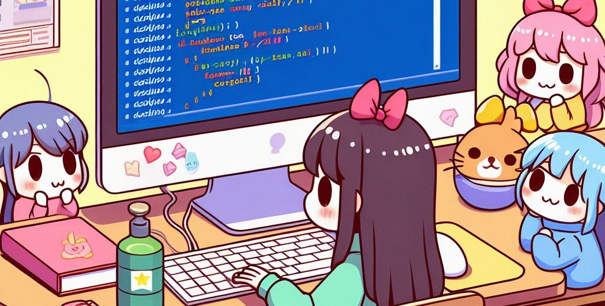
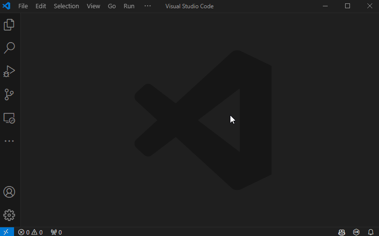
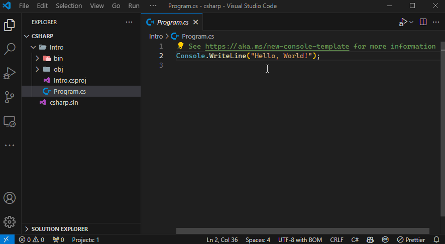

# เขียนโค้ดครั้งแรก

🤔เขียนโค้ดครั้งแรก มันเริ่มจากตรงไหน? อ่านโค้ดยังไงถึงจะเข้าใจ? แต่ละคำสั่งคืออะไยหว่า? **ดช.แมวน้ำ** มีคำตอบให้กั๊ฟป๋ม



> ภาพจาก [Microsoft Copilot](https://th.bing.com/th/id/OIG3.D43A2KRfW2GKfPD1Wuv9)

---

<PartialExample name="shared" />
import PartialExample from './_shared.md';

## 🧑‍💻สร้างพื้นที่เขียนโค้ด {#create-project}
หลังจากที่เราเตรียมเครื่องพร้อมลุยจากบทความ <Yellow>[ติดตั้งโปรแกรม](/docs/code/procedural/install)</Yellow> แล้ว สิ่งถัดไปก่อนที่เราจะเขียนโค้ดได้นั้น เราจะต้อง **สร้างพื้นที่สำหรับเขียนโค้ด** ของเรากันก่อน โดยเปิด **Visual Studio Code** ขึ้นมา แล้วทำตามขั้นตอนด้านล่างกันได้เรย
    1. เปิดเมนู <Gray>Explorer</Gray> ออกมา โดยกดเปิดได้จากเมนูด้านบน `View > Explorer`
    1. ที่เมนู Explorer ให้กดปุ่ม <Gray>New .NET Project</Gray> แล้วรอซักครู่แล้วจะมีหน้าต่างโผล่ขึ้นมา
    1. ให้พิมพ์คำว่า <Gray>Console App</Gray> ลงไปแล้วกด Enter ได้เลย
    1. โปรแกรมจะถามว่าเราจะเก็บโค้ดไว้ที่ไหนดี? ซึ่งในตัวอย่างนี้ป๋มจะเก็บไว้ที่ `d:\csharp` กั๊ฟป๋ม ส่วนเพื่อนๆสามารถเลือกที่เก็บได้ตามใจชอบเลยนะ
    1. โปรแกรมจะให้เรา <Gray>ตั้งชื่อโปรเจค</Gray> ซึ่งในตัวอย่างนี้ป๋มจะตั้งชื่อว่า `Intro` กั๊ฟป๋ม ส่วนเพื่อนๆสามารถตั้งชื่อได้ตามใจชอบเลยนะ
    1. โปรแกรมจะถามว่าจะยอมให้โฟเดอร์ที่กำลังจะเปิดสามารถรันคำสั่งต่างๆได้หรือเปล่า? จิ้มปุ่ม <Blue>Yes, I trust the authors</Blue> อย่างไว 🥲
    1. หลังจากที่ทุกอย่างโหลดเสร็จ ให้เราเปิดไฟล์ <Gray>Program.cs</Gray> ขึ้นมา เราก็จะพร้อมเขียนโค้ดของเราแย้วกั๊ฟป๋ม

    

:::tip[เกร็ดความรู้]
* ในการเขียนโค้ดไม่ว่าจะเป็นภาษาอะไรก็ตาม ส่วนใหญ่เราจะต้องสร้างพื้นที่ในการเขียนโค้ดของภาษานั้นๆเอาไว้ก่อน ซึ่งในภาษาเดฟเราเรียกว่า <Green>การสร้างโปรเจค (Project)</Green> ซึ่งต่อไปนี้ป๋มจะเรียกมันว่า **"การสร้างโปรเจค"** นะจ๊ะ โดยเจ้าโปรเจคที่เราสร้างขึ้นมาจะถูกกำหนดเวอร์ชั่นของภาษาที่เราใช้ และอาจจะเพิ่มสิ่งอำนวยความสะดวกต่างๆเพื่อให้เราทำงานง่ายขึ้นเ ซึ่งรายละเอียดพวกนี้เดี๋ยวเราจะค่อยๆเรียนรู้กันในบทถัดๆไปนะจุ๊ 😚
* โปรเจคที่เราสร้างขึ้นในรอบนี้คือ <Green>Console App</Green> ที่ทำงานกับข้อความบนหน้าจอเป็นหลัก ดังนั้นมันจะเหมาะกับการหัดเขียนโค้ดใหม่ๆ เพราะในช่วงแรกๆเราจะโฟกัสเฉพาะการเขียนโค้ดเพียงอย่างเดียว ยังไม่ได้สนใจเรื่องความสวยงามขอโปรแกรมเท่าไหร่นั่นเองงับ
:::

## 🤔สั่งให้คอมทำงานทำไง? {#run}
หลังจากทำขั้นตอนด้านบนเสร็จแล้ว ถัดมาเราก็จะลองเอาโค้ดที่ถูกเขียนไว้ในไฟล์ <Gray>Program.cs</Gray> ส่งไปให้คอมของเรานำไปทำงานดู โดยเราจะใช้ `VS Code` ตามขั้นตอนด้านล่างนี้เลยฮั๊ฟ
    1. ที่เมนูด้านบนให้กดที่ `Run > Run Without Debugging`
    1. เลือกภาษา <Gray>C#</Gray> แล้วกด Enter
    1. เลือก <Gray>ชื่อโปรเจคที่เราสร้างไว้</Gray> (ในตัวอย่างนี้คือ `Intro`) แล้วกด Enter
    1. รอสักครู่แล้วจะเห็นผลลัพท์โผล่ขึ้นมาด้านล่าง ซึ่งเราจะเห็นข้อความว่า  <Blue>Hello, World!</Blue>

    

:::tip[เกร็ดความรู้]
การสั่งให้คอมนำโค้ดของเราไปทำงาน โดยปรกติเราจะเรียกว่า <Green>**การรันโปรแกรม (Run)**</Green> ดังนั้นต่อไปนี้ป๋มจะเรียกมันว่า **"การรัน"** นะกั๊ฟ (เย่ได้ศัพท์เพิ่มแย้ว 🥳) ... การรันโค้ดจริงๆสามารถทำได้หลายวิธีเยย เดี๋ยวเราค่อยๆเรียนรู้กันไปในบทถัดๆไปนะจุ๊
:::

## 🥲สอนอ่านโค้ดหน่อย {#how-does-it-work}
ในช่วงแรกของการฝึก เราจะใช้ไฟล์ <Gray>Program.cs</Gray> เป็นจุดเริ่มต้นในเขียนโค้ดกันไปยาวๆ ดังนั้นเราก็จะมาทำความเข้าใจโค้ดพื้นฐานที่เขาเตรียมไว้กันดีก่า ซึ่งมันจะมีหน้าตาประมาณโค้ดด้านล่างนี้

```csharp showLineNumbers title="Program.cs"
// See https://aka.ms/new-console-template for more information
Console.WriteLine("Hello, World!");
```

:::note[หมายเหตุ]
ถ้าโค้ดไม่เหมือนกับของ **ดช.แมวน้ำ** ก็ไม่ต้องตกใจน้า มันเปลี่ยนไปตามเวอร์ชั่นของ .NET กั๊ฟ
:::

เมื่อเราเอาโค้ดด้านบนไปรัน เราก็จะเห็นข้อความ <Blue>**Hello, World!**</Blue> ออกมาบนหน้าจอ ซึ่งจากตรงนี้จะทำให้เราพอเดาได้ว่า <Gray>คำสั่งในบรรทัดที่ 2 คือการพิมพ์ข้อความออกทางหน้าจอ</Gray> 

เพื่อพิสูจน์ความเข้าใจเราก็จะลองเล่นซนนิสโหน่ย โดยการแก้โค้ดให้เป็นตามบรรทัดสีเทาด้านล่าง

```csharp showLineNumbers title="Program.cs" {2-3}
// See https://aka.ms/new-console-template for more information
Console.WriteLine("Hello, Saladpuk!");
Console.WriteLine("Don't forget to subscribe na krub!!");
```

คราวนี้เมื่อเราเอาโค้ดด้านบนไปรัน เราก็จะเห็นข้อความตามด้านล่าง

<Blue>**Hello, Saladpuk!**</Blue>  
<Blue>**Don't forget to subscribe na krub!!**</Blue>

โอ้วเย่!! เพียงเท่านี้เราก็จะรู้จักคำสั่งแรกแล้วนั่นคือ <Green>Console.WriteLine</Green> **ที่ทำหน้าที่พิมพ์ข้อความออกหน้าจอนั่นเอง** โดยเราสามารถสั่งให้มันพิมพ์อะไรออกมาก็ได้ โดยใส่ข้อความที่ต้องการไว้ภายในเครื่องหมายฟันหนู `"` หรือชื่อในภาษาอังกฤษคือ double quote (อ่านว่า `ดับเบิ้ล-โควท`) 🥳

**🤨 แล้วโค้ดบรรทัดที่ 1 คือไย?**  
อุ๊วต๊ะเกือบลืม!! เจ้าบรรทัดที่ 1 เมื่อเราดูดีๆจะพบว่า **มันเป็นการเขียนข้อความภาษาอังกฤษธรรมดาๆเลย ไม่น่าจะใช่คำสั่งใดๆ** ดังนั้นป๋มจะลองแก้โค้ดพิมพ์ข้อความธรรมดาเข้าไปเพิ่มตามบรรทัดสีเทาด้านล่างดูหน่อยจิ๊

```csharp showLineNumbers title="Program.cs" {4}
// See https://aka.ms/new-console-template for more information
Console.WriteLine("Hello, Saladpuk!");
Console.WriteLine("Don't forget to subscribe na krub!!");
เด็กชายแมวน้ำมาเยือนแย้ววววว
```

แต่เมื่อเราจะเอาโค้ดด้านบนไปรัน คอมมันจะแจ้งเตือนว่า <Red>มันไม่รู้จักคำสั่งเด็กชายแมวน้ำมาเยือนแย้ววววว</Red> และไม่สามารถเอาไปทำงานใดๆได้เลย 😭

ซึ่งจากตรงนี้จะทำให้เรารู้ว่า ~~อย่าสูดxาวเยอะ🥴~~ <Gray>โค้ดไม่สามารถเขียนมั่วซั่วได้ เราต้องค่อยๆเก็บเวลเรียนทีละคำสั่งไปเรื่อยๆ</Gray>

**🤨 แล้วโค้ดบรรทัดที่ 1 ทำไมเขาเขียนได้หล่ะ?**  
อุ๊วต๊ะนั่นดิ!! เมื่อเราดูดีๆจะพบอีกว่าโค้ดในบรรทัดที่ 1 **มันมีเครื่องหมาย `//` อยู่ด้านหน้าสุดด้วยนะ** ซึ่งมันแทบจะเป็นเรื่องเดียวที่ต่างกับบรรทัดที่ 4 ที่เราเพิ่มเข้าไป (ถ้าไม่นับว่ามันเป็นภาษาไทยอะนะ 😆) ดังนั้นป๋มก็จะลองแก้โค้ดบรรทัดที่ 4 โดยใส่เครื่องหมาย `//` เข้าไปด้วย ตามบรรทัดสีเทาด้านล่าง

```csharp showLineNumbers title="Program.cs" {4}
// See https://aka.ms/new-console-template for more information
Console.WriteLine("Hello, Saladpuk!");
Console.WriteLine("Don't forget to subscribe na krub!!");
// เด็กชายแมวน้ำมาเยือนแย้ววววว
```

เพียงแค่นี้เราก็สามารถเอาโค้ดด้านบนไปรันได้โดยไม่มีปัญหาใดๆเลย และได้ผลลัพท์เหมือนเดิมตามด้านล่าง (แถมบรรทัดที่ 4 สีตัวอักษรก็ถูกเปลี่ยนเหมือนบรรทัดที่ 1 ด้วย เย่ๆ)

<Blue>**Hello, Saladpuk!**</Blue>  
<Blue>**Don't forget to subscribe na krub!!**</Blue>

โอ้วเย่!! เพียงเท่านี้เราก็จะรู้จักคำสั่งที่สองแล้วนั่นคือ <Green>//</Green> **ที่ทำหน้าที่สั่งให้คอมไม่ต้องสนใจโค้ดที่อยู่ด้านหลัง** ซึ่งหมายความว่า โค้ดอะไรก็ตามที่ถูกเขียนไว้หลังเครื่องหมาย `//` จะถูกตีความว่ามันไม่มีตัวตนอยู่เลย ซึ่งเจ้าเครื่องหมาย `//` นี้เราเรียกว่า ทับ-ทับ หรือภาษาอังกฤษคือ slash slash (อ่านว่า `สแลช-สแลช`) โดยมันคือ <Gray>คำสั่ง **Comment**</Gray> นั่นเอง (อ่านว่า `คอมเมนต์`) 🥳

:::tip[เกร็ดความรู้]
คำสั่ง comment เรานิยมเอาไว้ใช้ 2 อย่างคือ `ใช้อธิบายว่าโค้ดตรงนี้มันเอาไว้ทำอะไร` หรือ `อยากเก็บโค้ดนี้ไว้อยู่ชั่วคราวโดยไม่อยากลบมันออก`
:::

ดังนั้นเราก็ลองเล่นซนเป็นรอบสุดท้าย โดยการลองใส่ `//` ลงไปด้านหน้าสุดของบรรทัดที่ 3 ตามสีเทาด้านล่าง

```csharp showLineNumbers title="Program.cs" {3}
// See https://aka.ms/new-console-template for more information
Console.WriteLine("Hello, Saladpuk!");
// Console.WriteLine("Don't forget to subscribe na krub!!");
// เด็กชายแมวน้ำมาเยือนแย้ววววว
```

ซึ่งเมื่อลองเอาโค้ดด้านบนไปรัน เราก็จะเจอข้อความ <Blue>**Hello, Saladpuk!**</Blue> ออกมาเพียงตัวเดียวเท่านั้น เพราะในโค้ดของเรามีแค่บรรทัดที่ 2 เท่านั้นที่ไม่ได้ถูก comment เอาไว้นั่นเองงับ (โค้ดบรรทัดอื่นนั้นไร้ตัวตน😆)

:::tip[เกร็ดความรู้]
จะเห็นว่า **ดช.แมวน้ำ** จะพาเพื่อนๆมาเล่นซนโดย <Green>ค่อยๆแก้โค้ดแล้วรันดูผลลัพท์</Green> ซึ่งจะทำวนซ้ำไปเรื่อยๆเพื่อให้เพื่อนๆเข้าใจแต่ละคำสั่ง และ เข้าใจหลักการทำงานของโค้ด ซึ่งป๋มคิดว่านี่เป็นวิธีการที่จะช่วยให้เราสามารถเขียนโค้ดได้โดยไม่ต้องท่องจำและเร็วที่สุด เพราะมันเกิดจากความเข้าใจจากที่ได้ลองเล่นนั่นเอง และจากการที่ <Green>โค้ดมันเป็นสิ่งที่พิสูจน์ได้</Green> เพราะมันจะทำงานเหมือนเดิมทุกครั้ง ดังนั้นถ้าเราเข้าใจผิด ผลลัพท์ที่ได้ก็จะผิดตามนั่นเอง ดังนั้นกระป๋มเลยอยากให้เพื่อนๆได้ลองเล่นด้วยตัวเองดู แก้นิด รันหน่อย แล้วดูผลลัพท์ว่ามันยังตรงกับที่เข้าใจอยู่หรือเปล่า ซึ่งนี่เป็นทริกที่ช่วยให้ผมสามารถเรียนรู้เรื่องราวของโค้ดได้โดยไม่เคยต้องท่องจำเลยนั่นเองขอรับ 😉
:::

## 🥳สรุป {#summary}
ถึงตรงนี้ **ดช.แมวน้ำ** คิดว่าเพื่อนๆน่าจะเห็นแนวทางเริ่มต้นในการเขียนโค้ดกันแย้ว ซึ่งป๋มอยากให้เพื่อนๆ <Gray>จดเรื่องด้านล่างเก็บเอาไว้</Gray> เพราะเราจะได้ใช้มันไปยาวๆๆๆจนจบคอร์สนี้เยยงับ ส่วนใครที่จดเสร็จแล้วก็เลื่อนลงไปจิ้มอ่านบทถัดไปได้เรยยยย ย ย

:::info[จดเอาไว้-จำจงดี]
* <Blue>Run > Run Without Debugging</Blue> → คือการสั่งให้คอมรันโค้ดของเรา (อย่าลืมเซฟไฟล์ก่อนรันด้วยนะ 😘)
* <Blue>//</Blue> → คือการสั่งให้คอมไม่ต้องสนใจโค้ดที่อยู่ด้านหลังเครื่องหมาย `//` ทั้งหมด
* <Blue>Console.WriteLine("ข้อความ");</Blue> → คือการสั่งให้คอมเอาของที่อยู่ในเครื่องหมาย `"..."` ไปพิมพ์ออกที่หน้าจอ
:::