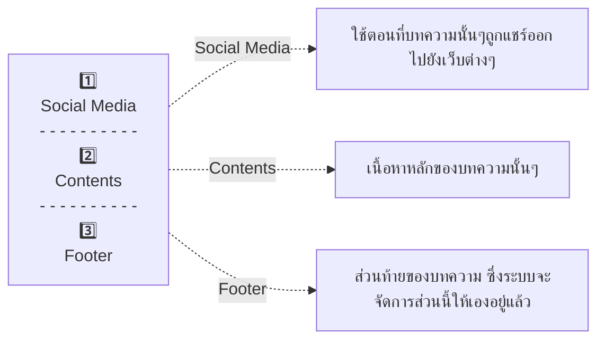

# {frontMatter.title}

<p>{frontMatter.description}</p>


<blockquote>ภาพจาก <a href={frontMatter.image} target="_blank">Microsoft Copilot</a></blockquote>

---

:::warning
การเขียนอะไรก็ตามแต่ **ดช.แมวน้ำ** ขอให้เพื่อนๆคิดในมุมว่าซักวันหนึ่งลูกหลานแมวน้ำของเราอาจจะได้กลับมาอ่านก็เป็นได้ ดังนั้นการใช้ภาษา ภาพ ข้อความ ไม่ควรก่อนให้คนอื่นเดือนร้อน หรือรู้สึกไม่ดีในการอ่านนะครับ ส่วนไอเดียในการแต่งเติมให้เนื้อหาสนุกเร้าใจ ไม่รู้สึกว่าโดนบังคับให้อ่าน อันนี้แล้วแต่ความบรรเจริดแต่ละคน จ๊าดมาได้เต็มที่โลดดดดด 😊
:::

## 📑บทความ {#article}
1. หากเป็นการแก้ไขคำผิด หรือ ปรับปรุงเนื้อหา เพื่อนๆสามารถจัดการเองได้เลย แค่ส่ง PR พร้อมบอกว่าเป็นการ แก้ไขคำผิดหรือปรับปรุงเนื้อหา ก็เพียงพอแว้วงับ
1. หากเป็นการเพิ่มเนื้อหาใหม่ ฝากเพื่อนๆลองดูว่าเนื้อหานั้นอยู่ใน <Blue>🛣️Roadmap</Blue> หรือเปล่า [(จิ้มดูตรงนี้ได้เลย)](../../roadmap)
    * `อยู่ใน Roadmap` เพื่อนๆสามารถ Fork ออกไปจัดการเองได้เลย ซึ่งตอนส่ง PR รบกวนระบุว่าเป็นส่วนไหนใน Roadmap ด้วยนะ
    * `ไม่อยู่ใน Roadmap` ในเคสนี้ **ดช.แมวน้ำ** อยากให้เราได้ลองคุยกันก่อน โดยสามารถส่งไอเดียมาใน [Github Issue](https://github.com/saladpuk/edu/issues) ได้เลย (ยังไม่มีรูปแบบหรือข้อจำกัดใดๆร่างได้ตามใจชอบเยย)
1. การตั้งชื่อไฟล์หรือโฟเดอร์ต่างๆจะต้องเป็น **ตัวภาษาอังกฤษตัวพิมพ์เล็กหรือตัวเลขเท่านั้น**
    * ห้ามตั้งชื่อขึ้นต้นด้วยตัวเลข
    * ห้ามใส่ ตัวอักษรพิเศษ, ช่องว่าง หรือ emoji ลงไปในชื่อไฟล์
    * สามารถใช้ `-` สามารถใช้ช่วยทำให้อ่านง่ายขึ้นได้ เช่น `this-is-a-file.md`

## 📌ส่วนประกอบต่างๆของบทความ {#segments}
บทความจะถูกแบ่งเป็น 3 ส่วนตามลำดับดังนี้



### 🔗Social Media
เมื่อเราสร้างไฟล์ `*.md` ขึ้นมาใหม่เพื่อเขียนบทความ **ขอให้ก๊อป template ด้านล่าง** เพื่อให้เป็นมาตรฐานเดียวกันในการจัดการเนื้อหาครับ

```markdown
---
sidebar_position: 0.00
title: ชื่อหัวข้อ
image: https://ลิงค์ของรูป.jpg
description: คำอธิบายเนื้อหาของบทความนี้แบบสั้นๆ
tags: [tag1, tag2]
---

# {frontMatter.title}

<p>{frontMatter.description}</p>


<blockquote>ภาพจาก <a href={frontMatter.image} target="_blank">Microsoft Copilot</a></blockquote>

---
```

:::note
1. **sidebar_position** → คือตำแหน่งที่บทความนี้จะอยู่ใน Sidebar ด้านซ้ายของเว็บ โดยระบบจะเรียงลำดับการแสดงผลจากเลขน้อยไปมาก ซึ่งปรกติก็ให้เราเพิ่มเลขเข้าไปได้เรื่อยๆทีละ 1 ได้เลย ส่วนกรณีที่เลขมันวิ่งไปแล้ว แต่เรามีบทความที่อยากแทรกเข้า เช่นระหว่าง 1 กับ 2 ก็สามารถทำได้โดยใช้หลักทศนิยมโดยเพิ่มทีละ 0.01 งับ
1. **title** → คือชื่อที่เราต้องการให้เพื่อนๆเห็นเมื่อเข้ามาอ่านบทความนี้ โดยจะใส่หรือไม่ใส่ emoji ก็ได้ (แต่ถ้าใส่จะต้องห้ามเว้นวรรค์ เพราะมันจะทำให้ URL ดูไม่เป็นระเบียบงับ)
1. **image** → ลิงค์รูปภาพของบทความนี้ ซึ่งจะถูกนำไปแสดงผลตอนแชร์ลง social media ด้วย และเพื่อเป็นการตัดปัญหาเรื่องลิขสิทธิ์ ป๋มอยากให้ใช้ AI ในการ generate ออกมางับ ส่วนถ้าไปเอามาจากที่อื่นก็รบกวนใส่เครดิตจากแหล่งที่เอามากันด้วยน้าาาา
    * ขนาดรูปภาพที่เหมาะสมไม่ควรเกิน 1024x520 พิกเซลงับ
    * ควรจะเป็นรูปสี่เหลี่ยมผืนผ้าแนวนอน และ ขนาดไฟล์ไม่ควรเกิน 300KB งับ
1. **description** → คำอธิบายเนื้อหาแบบสั้นๆ ซึ่งจะถูกนำไปแสดงผลตอนแชร์ลง social media ด้วย
1. **tags** คือแท็กที่เราคิดว่ามันน่าจะเกี่ยวข้องกับบทความนั้นๆ ซึ่งในท้ายบทความเราจะสามารถค้นหาบทความที่เกี่ยวข้องกับแท็กเหล่านั้นได้ (เพื่อนๆสามารถเพิ่มหรือลบได้ตามความเหมาะสม)
:::

:::tip
สำหรับใครที่ยังไม่เคยใช้ AI ช่วยสร้างรูป สามารถลองกดไปเล่นได้ฟรีๆจากลิงค์นี้เบย [Microsogy Bing Chat](https://www.bing.com/chat) ซึ่งเมื่อเข้าไปแล้วจะลองพิมพ์ภาษาไทยหรือภาษาอังกฤษก็ได้ หรือลองก๊อปข้อความด้านล่างไปวาง เพื่อให้เขาสร้างรูปให้ได้เรย (รูปที่วาดในแต่ละรอบมีโอกาสสูงมากที่จะไม่ได้รูปเดิม ดังนั้นถ้าถูกใจแนะนำให้เซฟลงเครื่องไว้ก่อนได้จะดีกั่ว)

```text
วาดรูปแมวน้ำขี่หลังโดเรม่อนให้หน่อย โดยใช้ลายเส้นการ์ตูนญี่ปุ่นน่ารักๆ
```

<details>
  <summary>(จิ้มอย่างแผ่วเบา) เพื่อดูผลลัพท์</summary>
  <div>
    <div>
        
        > ภาพจาก [Microsoft Copilot](https://th.bing.com/th/id/OIG2.owVWAuKn.8qQiZE.NsKD?pid=ImgGn)
    </div>
  </div>
</details>
:::

### 📝Contents
1. ในส่วนของเนื้อหา ป๋มขอแค่ให้เพื่อนๆแยกหัวข้อเป็นเรื่องๆโดยใช้ Markdown `##` กับ `###` ก็น่าจะเพียงพอแล้วงับ 
2. การใส่ลิงค์ภายในเว็บสลัดผัก ให้ใช้ Markdown แบบนี้ได้เยย `[ชื่อลิงค์](/path/to/page)` ไม่ต้องใส่นามสกุลไฟล์ ส่วนถ้าเป็นเว็บอื่นๆก็ให้ใส่ Full URL ไปเลย `[ชื่อลิงค์](https://www.example.com)`
3. การใส่รูปภาพเข้ามาในโปรเจค ขอให้ใส่ไว้ในโฟเดอร์ `assets` ตาม path ของบทความนั้นๆนะ
    * **ตัวอย่าง 1** หน้าเว็บที่เพื่อนเปิดอยู่นี้ จะเห็นว่ามี URL เป็น `docs/contribute/conventions` ซึ่งหมายความว่า ต้องเอาไฟล์รูปภาพไปใส่ใน `docs/contribute/assets` นั่นเอง
    * **ตัวอย่าง 2** สมมุติว่า URL เป็น `docs/a/b/c/d` ก็ต้องเอาไฟล์รูปภาพไปใส่ใน `docs/a/b/c/assets` นั่นเอง
4. การอ้างรูปที่อยู่ในโปรเจค ให้ใช้ Markdown แบบนี้ได้เลย ``

:::tip
1. เทคนิคส่วนตัวผมจะ <Green>เกริ่นปัญหาไว้เป็นหัวข้อแรกสุด</Green> เพื่อทำให้เพื่อนๆเข้าใจว่าบทความนั้นๆจะช่วยแก้ปัญหาเรื่องอะไร แล้วหัวข้อถัดไปก็จะเป็นการไขปัญหาหรือชวนเพื่อนๆคิดไปทีละขั้นตอน จนได้แนวทางแก้ปัญหาแบบต่างๆนั่นเองฮั๊ฟ ... หรือบางทีหลังจากแก้ปัญหาได้แล้ว ป๋มก็จะยังแอบทิ้งท้ายให้ชวนคิดถึงกรณีต่างๆที่อาจเกิดขึ้นได้ เพื่อให้เราได้เห็นภาพ scenarios ที่ครอบคลุมมากขึ้นนั่นเองงงง 😗
2. เทคนิดปิดท้าย <Green>สรุปประเด็นทั้งหมดไว้เป็นหัวข้อสุดท้าย</Green> เพื่อเป็นการขมวดเรื่องราวทั้งหมดให้คนอ่านได้เข้าใจว่า สาระสำคัญของเรื่องคืออะไร หรือ ถ้าเขาสนใจจะศึกษาต่อจะต้องไปที่ไหน ฯลฯ (ส่วนใหญ่ก็จะแอบแนบลิงค์ไปหา [Facebook สลัดผัก](https://www.facebook.com/mr.saladpuk) แบบนี้อ่ะนะ 🤣)
:::

### 🐾Footer
ในส่วนสุดท้ายนี้ระบบจะจัดการให้เอง โดยเน้นไปที่การช่วยให้ผู้อ่านสามารถไปยังเนื้อหาถัดไป หรือเนื้อหาที่เกี่ยวข้องได้ง่ายขึ้น หากใครมีไอเดียอะไรสำหรับส่วนนี้สามารถเสนอได้เยยน้าาา

:::danger[ตรวจงานก่อนส่ง]
หลังจากแก้ไขจบพอใจแล้ว รบกวนพี่ป้องลองสั่ง `npm run build` หรือ `pnpm build` ดูนะครับว่าผ่านหรือเปล่า ซึ่งถ้าไม่ผ่านแสดงว่าที่เพื่อนแก้ไปน่าจะมีปัญหาซักอย่างที่ต้องแก้ก่อนส่ง PR งับ 😊
:::

<Comment />