# 🥳แบ่งปันฟามรู้

สำหรับคนที่อยากแบ่งปันประสบการณ์ที่อัดแน่นอยู่เต็มพุงให้เหล่าผองเพื่อนแมวน้ำ สามารถช่วยลงบทความให้กับสลัดผักได้แย้วนะ ส่วนแมวน้ำที่พึ่งหัดเดินก็สามารถเข้ามาช่วยได้นะ อย่างน้อยก็เป็นการฝึกทำ Code Review ที่เดี๋ยวก็จะได้เจอตอนทำงานแน่นวล 😆


> ภาพจาก [Microsoft Copilot](https://th.bing.com/th/id/OIG1.1EiVlnUB8aIIgcmaZ7Jd?pid=ImgGn)

---

## 🎯ต้องรู้อะไรบ้าง?
เนื้อหาทั้งหมดของเว็บสลัดผักถูกเขียนด้วย <Gray>Markdown</Gray> เกือบทั้งหมดเลย ดังนั้นเพียงแค่เพื่อนๆรู้สึกอยากแบ่งปัน ก็สามารถบรรเลงถ่ายทอดความรู้ที่อัดในพุงออกมาได้เบย ส่วนของที่ต้องติดตั้งเพิ่มก็จะมี <Gray>Visual Studio Code</Gray>, <Gray>Git</Gray> และ <Gray>Node.js</Gray> ที่เหล่าขาเดฟต้องได้ใช้อยู่ทุกวี่วันนั่นเอง

ตัวเว็บสลัดผักทั้งเว็บจะอยู่ใน [Github](https://github.com/saladpuk/edu) ทั้งหมดเลย ดังนั้นก็ clone ลงเครื่องด้วยคำสั่งด้านล่าง

```bash
git clone https://github.com/saladpuk/edu.git
```

ถัดมาก็ลองเปิดเล่นที่เครื่องตัวเองได้จากการรัน 2 คำสั่งด้านล่าง ซึ่งหลังจากรันแล้วรอซักครู่ใหญ่ๆหน้าเว็บ http://localhost:3000 ขึ้นมาให้เองงับ (จะใช้ pnpm ก็ได้เช่นกันนะจ๊ะ😘)

```bash
npm install
npm start
```

<details>
  <summary>(จิ้มอย่างแผ่วเบา) เพื่อดูลิงค์ในการติดตั้ง</summary>
  <div>
    <div>
    * [Git](https://git-scm.com) - เป็นเครื่องมือในการจัดการโค้ดให้เป็นระบบ สามารถควบคุมเวอร์ชันต่างๆได้ดั่งใจนึก
    * [Node.js](https://nodejs.org) - เป็นเครื่องมือในการจัดการ package ต่างๆในการพัฒนาโปรแกรม
    * [Visual Studio Code](https://code.visualstudio.com) - เป็นเครื่องมือในการเขียนพัฒนาโปรแกรมที่ได้รับความนิยมมากๆของโลก
    </div>
  </div>
</details>

## 📁โครงสร้างของเว็บ
บทความต่างๆของเว็บสลัดผักมีโครงสร้างที่เข้าใจง่ายมาก เพียงแค่ดูจาก URL ที่แสดงอยู่ก็จะรู้ได้เลยว่าไฟล์ของบทความนั้นๆถูกเก็บไว้ที่ไหน เช่น หน้าที่เพื่อนๆกำลังอ่านอยู่นี้จะมีลิงค์เป็น `docs/contribute/creator` ซึ่งก็หมายความว่า ถ้าจะแก้ไขเนื้อหาของหน้านี้ ก็ให้เข้าไปดูที่ไฟล์ `docs/contribute/creator.md` นั่นเอง

ตัวเว็บสลัดผักนั้นจะแบ่งประเภทบทความเป็น 2 ชนิดนั่นคือ <Gray>ฟามรู้</Gray> และ <Gray>บ่นไปวันๆ</Gray> โดยมีความต่างกันคือ
1. **ฟามรู้** จะจัดเรียงบทความแยกตามประเภทของเนื้อหา เช่น คอร์สภาษา C#, DevOps ฯลฯ ซึ่งสามารถดูประเภทได้ตาม [Roadmap](../../roadmap) ที่หน้าหลักของเว็บสลัดผัก ซึ่งไฟล์ทั้งหมดจะอยู่ในโฟเดอร์ `docs`
2. **บ่นไปวันๆ** จะเป็นบทความที่เกี่ยวกับประสบการณ์ในการทำงาน ข้อคิด บทเรียน หรืออะไรก็ตามแต่ที่ ดช.แมวน้ำ อยากจะบ่น ฮ่าๆ ส่วนไฟล์ของเนื้อหาประเภทนี้จะอยู่ในโฟเดอร์ `blog`

    ```csharp
    📁Root
    ├── 📁docs  // ฟามรู้
    └── 📁blog  // บ่นไปวันๆ
    ```

## 😋คันมืออยากเริ่มละทำไง?
ถ้าได้อ่าน [`ข้อตกลงร่วมกัน`](./conventions) และ สามารถเขียน Markdown ได้เรียบร้อยแล้วก็สามารถส่ง PR มาได้เลยจร้า ส่วนขั้นตอน **ดช.แมวน้ำ** ขอแยกเป็น 2 แบบตามด้านล่างนี้น๊ะ 

1. การเพิ่มเนื้อหาฟามรู้ใหม่ๆ หรือ แก้บทความที่มีอยู่แย้ว จะเป็นไปตามพิธีด้านล่างนี้

```mermaid
stateDiagram
  direction LR
  state "1️⃣Github Fork" as Fork
  state "2️⃣บรรเลงเนื้อหา" as Edit
  state "3️⃣Pull Request" as PullRequest
  [*] --> Fork
  Fork --> Edit
  Edit --> PullRequest: เสร็จส่งตรวจ
  PullRequest-->PullRequest: 4️⃣แมวน้ำตรวจสอบ
  PullRequest --> Edit: มีปรับแก้
  PullRequest --> [*]: 5️⃣รับงานเย่ 🥳
```


<details>
  <summary>จิ้มตรงนี้เพื่อดูวิธีการทำ Fork & PR</summary>
  <div>
      <div>
        การส่ง PR (Pull Request) เป็นท่าพื้นฐานที่ Community/Open-source projects ต่างๆทั่วโลกใช้ในการส่งงานกัน ซึ่งเพื่อนๆสามารถลองทำตามขั้นตอนด้านล่างนี้ เพื่อเริ่มต้นในการช่วยเหลือสลัดผักได้เบยฮ๊าฟ <Green>ลองหาคำผิดเล็กๆน้อยๆแก้แล้วส่งมาก็ได้ 🥰</Green>
        1. เข้าไปที่ [<Icon icon="fa-brands fa-github" size="lg" /> https://github.com/saladpuk/edu](https://github.com/saladpuk/edu) (จิ้มลิงค์ได้เยย)
        2. ที่ด้านบนขวากดปุ่ม <Gray><Icon icon="fa-solid fa-code-fork" /> Fork</Gray>
        3. ทำการ Clone โปรเจคที่เพิ่ง Fork มาลงเครื่อง
        4. เริ่มบรรเลงเนื้อหาต่างๆที่ต้องการได้เยย
        5. เมื่อทำจนพอใจแล้วก็ Commit และ Push ขึ้น Github ของตัวเอง
        6. กลับไปที่ Github ดูที่ด้านบนซ้าย ให้กดปุ่ม <Gray><Icon icon="fa-solid fa-code-pull-request" /> Pull Request</Gray> พร้อมสรุปรายละเอียดสั้นๆลงไปใน PR message แล้วกดส่ง
        7. รอ **ดช.แมวน้ำ** ทำการตรวจสอบ ... หากไม่มีปัญหาใดๆ PR ตัวนั้นๆก็จะถูกรวมเข้าไปในเว็บสลัดผักเยย เย่ 🥳
        8. หาก **ดช.แมวน้ำ** ตรวจแล้วมีประเด็น ก็จะ comment ตอบกลับใน PR นั้นๆ แล้วป๋มก็รอเพื่อนๆแก้ไขตามหรือตอบกลับมากั๊ฟป๋ม ... จนกว่าจะเรียบร้อยก็จะถูกรวมเข้าไปในเว็บสลัดผักเยย
      </div>
  </div>
</details>

2. กรณีเพื่อนๆต้องการที่จะ เสนอไอเดีย หรือ แจ้งปัญหา จะเป็นไปตามพิธีด้านล่างนี้

```mermaid
stateDiagram
  direction LR
  state "1️⃣Github Issue" as Issue
  [*] --> Issue
  Issue --> Issue: 2️⃣คุยถามตอบให้เราเข้าใจตรงกัน
  Issue --> [*]: 3️⃣ดำเนินการ 🥰
```


<details>
  <summary>จิ้มตรงนี้เพื่อดูวิธีสร้าง Github Issue</summary>
  <div>
      <div>
        การสร้าง Issue เป็นท่าพื้นฐานที่ Community/Open-source projects ต่างๆทั่วโลกใช้ในการแจ้งปัญหา หรือ เสนอไอเดียใหกับผู้ดูแลโครงการนั้นๆ ซึ่งเพื่อนสามารถลองทำตามขั้นตอนด้านล่างนี้เพื่อเสนอแนวคิดใหม่ๆ หรือแจ้งปัญหาที่พบเจอได้เยยงับ 🥰
        
        1. เข้าไปที่ [<Icon icon="fa-brands fa-github" size="lg" /> https://github.com/saladpuk/edu/issues](https://github.com/saladpuk/edu/issues)
        2. ที่ด้านขวามือกดปุ่ม <Green>New issue</Green>
        3. ทำการใส่รายละเอียดต่างๆที่ต้องการแจ้งลงไป แล้วก็กดปุ่ม <Green>Submit new issue</Green> เพื่อทำการส่ง Issue
        4. รอ **ดช.แมวน้ำ** ทำการตรวจสอบ ... หากไม่มีปัญหาใดๆ Issue นั้นก็จะถูกเปลี่ยนสถานะไปตามความเหมาะสม เช่น รับเรื่อง, รอพิจารณา, ดำเนินการแล้ว ฯลฯ
            * ในระหว่างนี้เพื่อนๆแมวน้ำคนอื่นอาจจะมาแวะเวียนมาช่วยถาม/ช่วยตอบ ดังนั้นอย่าลืมตอบกลับเพื่อนๆแมวน้ำนะจ๊ะ 
      </div>
  </div>
</details>

:::note
ลูกเล่นต่างๆที่ช่วยให้เว็บสลัดผักดูไม่จืดชื่นเกินไป สามารถดูได้จากหัวข้อ [`🧸ของเล่นในสลัดผัก`](./creator#ของเล่นในสลัดผัก) ด้านล่างนะฮั๊ฟ
:::

:::tip
เขียนไม่เก่ง คิดคำไม่ออก กลัวเขียนแล้วอ่านไม่รู้เรื่อง ไม่ต้องห่วงน้าาา เพราะ **ดช.แมวน้ำ** และผองเพื่อนจะช่วยจัดการเกลาให้งับ (แม้ว่ากระป๋มยังงูๆปลาๆอยู่เช่นกันก็ตามฮ่าๆ) คิดซะว่าเป็นการฝึก เพราะทักษะการสื่อสารก็เป็นเรืองที่สำคัญไม่แพ้การเขียนโค้ดเลยนะจ๊ะ 🥰
:::

:::danger
หากเป็นการแก้คำผิด เพิ่มเนื้อหาเล็กๆน้อยๆ หรือ เขียนบทความใหม่ที่อยู่ใน [Roadmap](../../roadmap) ของสลัดผักอยู่แล้วส่วนใหญ่ก็จะผ่านไม่มีปัญหาอะไร แต่ถ้าเป็น <Red>เนื้อหาที่ไม่ได้อยู่ใน Roadmap อันนี้อยากให้ทักคุยกันใน [Github Issue](https://github.com/saladpuk/edu/issues) ก่อน</Red> จะเป็นพระคุณมากๆเลยขอรับ 🙇
:::

## 😅พึ่งหัดแต่ก็อยากช่วยนะ
จริงๆแค่ช่วย**แก้ไขคำผิดที่เจอ**กระป๋มก็น้ำตาปริ่มแล้วกั๊ฟ (แมวน้ำหัดเรียนภาษามนุษย์ก็ยากงี้แหละ🥲) ส่วนสำหรับมือใหม่จริงๆป๋มแนะนำให้เรียนรู้ภาษา <Blue>Markdown</Blue> ไว้แต่เนิ่นๆ จะช่วยให้ชีวิตเราสบายขึ้นเยอะครับ ดังนั้นลองมาหัดกันเรียนกันจากตรงด้านล่างได้เบยครัช

## 🐣Markdown 101
ภาษา Markdown จริงๆมันง่ายแบบฝุดๆ เพราะมันเป็นการเขียนข้อความธรรมดาๆ แต่แค่ใส่อักษรพิเศษเพิ่มเข้าไปนิดโหน่ย ก็จะทำให้ข้อความธรรมดาของเรา `ไม่ธรรมดา` ดังนั้นลองมาเล่นกันเยย
1. เปิด `Visual Studio Code` ขึ้นมาแล้วสร้างไฟล์ใหม่ โดยกดที่่เมนู `File > New Text File`
2. ทำการกำหนดว่าเราจะทำงานกับ Markdown โดยกดที่เมนู `View > Command Palette...` แล้วพิมพ์ `Change Language Mode` แล้วกด Enter แล้วให้เลือก `Markdown`
3. ทำการแยกหน้าจอเป็นสองส่วนเพื่อดูผลลัพท์ของ Markdown โดยกดที่เมนู `View > Editor Layout > Split Right`
4. ทำการสั่งให้หน้าจอแสดงผลเป็น Markdown โดยกดที่เมนู `View > Command Palette...` แล้วพิมพ์ `Markdown: Open Preview` แล้วกด Enter
5. ลองก๊อปข้อความด้านล่างนี้ไปวางใน Visual Studio Code แล้วดูผลลัพท์ที่แสดงอยู่ในหน้า Preview นะ
    ```markdown
    # ทักทาย
      
    สวัสดีผมชื่อ **ดช.แมวน้ำ** ซึ่งกระป๋มมี ~~พุงพลุ้ย~~ กล้ามท้องอันสวยงาม

    > _NOTE:_  
    > หากชอบเว็บสลัดผักก็ฝากกดติดตามใน Facebook ด้วยนะครับ [โดยสามารถจิ้มที่ตรงนี้ได้เบย](https://www.facebook.com/mr.saladpuk/)
    ```
    <details>
        <summary>(จิ้มอย่างแผ่วเบา) เพื่อดูผลลัพท์</summary>
        <div>
            <div>
                # ทักทาย
                  
                สวัสดีผมชื่อ **ดช.แมวน้ำ** ซึ่งกระป๋มมี ~~พุงพลุ้ย~~ กล้ามท้องอันสวยงาม

                > _NOTE:_  
                > หากชอบเว็บสลัดผักก็ฝากกดติดตามใน Facebook ด้วยนะครับ [โดยสามารถจิ้มที่ตรงนี้ได้เบย](https://www.facebook.com/mr.saladpuk/)
            </div>
        </div>
    </details>

เห็นมะไม่ได้ยากเยย แค่เติมตัวอักษรพิเศษเข้าไปก็บู้มมมมละ ซึ่งเพื่อนๆสามารถลองไปศึกษาต่อได้จากเว็บนี้เลยงับ [Markdown Guide](https://www.markdownguide.org/basic-syntax)

## 🧸ของเล่นในสลัดผัก
เบื้องหลังเว็บสลัดผักจริงๆคือ [Docusaurus](https://docusaurus.io) ซึ่งช่วยให้เราสามารถเขียน document ได้ง่ายขึ้น รองรับ React และมีความสามารถอื่นๆอีกมากมาย ซึ่งโดยเบื้องต้น **ดช.แมวน้ำ** ได้ปรับแต่งไว้เบื้องต้นแล้ว โดยมีลูกเล่นต่างๆตามนี้

:::note
หากเพื่อนๆเห็นว่า features ไหนมีประโยชน์ อยากเอาเข้ามา ก็สามารถส่งเข้ามาที่ [Github Issue](https://github.com/saladpuk/edu/issues) หรือ PR มาได้เลยนะครับ 😍
:::

### FontAwesome
ช่วยทำให้เรามีไอคอนสวยๆไปใส่ในบทความได้ เช่น <Icon icon="fa-solid fa-dragon" /> <Icon icon="fa-brands fa-github" size="lg" /> <Icon icon="fa-solid fa-dice" size="xl" /> <Icon icon="fa-solid fa-ghost" size="2xl" /> โดยสามารเลือกไอคอนได้จากเว็บหลัก [fontawesome.com](https://fontawesome.com) ได้เลย

### Admonitions
ช่วยให้เรามีกล่องข้อความหลากหลายรูปแบบ

:::note
เอาไว้ใส่ **โน๊ต** ต่างๆ
:::

:::tip
เอาไว้ใส่ **เกร็ดความรู้** ต่างๆ
:::

:::info
เอาไว้ใส่ **รายละเอียดเพิ่มเติม** ต่างๆ
:::

:::warning
เอาไว้ **แจ้งเตือนข้อควรระวัง** ต่างๆ
:::

:::danger
เอาไว้ **แจ้งเตือนกรณ์ให้ระวังมากๆๆ** ต่างๆ
:::

:::note[พิมพ์ **ชื่อหัวข้อ** ได้เองในรูปแบบ _Markdown_ `syntax` ได้ด้วย!]
ข้อความที่อยู่ในกล่องข้อความนี้จะเป็นข้อความที่เราต้องการให้เห็นเป็นพิเศษ
:::

### Mermaid
ช่วยทำให้เราเขียน Diagrams แบบต่างๆได้ง่ายขึ้น รายละเอียดการเขียนสามารถดูได้จากเว็บหลัก [Mermaid.js](https://mermaid.js.org/intro)


### Tabs
ช่วยให้เราสามารถสร้างหมวดในการแสดงผลได้

import Tabs from '@theme/Tabs';
import TabItem from '@theme/TabItem';

**คำสั่งในการคัดลอก**
<Tabs groupId="operating-systems">
  <TabItem value="win" label="Windows">กดปุ่ม `Ctrl` + `C` เพื่อทำการคัดลอก</TabItem>
  <TabItem value="mac" label="macOS" default>กดปุ่ม `Command` + `C` เพื่อทำการคัดลอก</TabItem>
</Tabs>

**คำสั่งในการวางสิ่งที่คัดลอกไว้**
<Tabs groupId="operating-systems">
  <TabItem value="win" label="Windows">กดปุ่ม `Ctrl` + `V` เพื่อทำการวาง</TabItem>
  <TabItem value="mac" label="macOS">กดปุ่ม `Command` + `V` เพื่อทำการวาง</TabItem>
</Tabs>

### Summary
ใช้ในการซ่อนเนื้อหาที่ยาวๆ

<details>
  <summary>จิ้มมาเยย เพื่อดูเนื้อหาที่ซ่อนไว้!</summary>
  <div>
    <div>อุ๊ตะ เห็นแล้วซินะ</div>
    <br/>
    <details>
      <summary>
        ไม่ให้ดูหรอก มีอะไรซ่อนอยู่น้าาา
      </summary>
      <div>แบร่👻</div>
    </details>
  </div>
</details>

### Custom Components
เป็น Component ที่สร้างขึ้นมาใช้งานเอง เช่น การทำไฮไลท์

<Highlight color="#c225c2">กำหนดสีเองได้</Highlight> หรือจะเป็นสีที่กำหนดตายตัวไว้แล้ว <Red>แดง</Red> <Green>เขียว</Green> <Blue>น้ำเงิน</Blue> <Gray>เทา</Gray>

### Quiz
ใช้ในการสร้างคำถามแบบง่ายๆ
<Quiz title="My Quiz Title" choices={frontMatter.choices} remarks={frontMatter.remarks} correctAnswer={frontMatter.correctAnswers} />

### Code Blocks
การแสดงผลโค้ดแบบต่างๆ

สามารถแสดงชื่อไฟล์ได้
```csharp title="Demo.cs"
int a = 3;
```

ใส่เลขบรรทัดได้
```csharp showLineNumbers
int a = 3;
int b = 5;
int c = 7;
```

ทำไฮไลท์บรรทัดได้
```csharp {1,4-5}
int a = 3;
int b = 5;
int c = 7;
int d = 9;
int e = 11;
int f = 13;
```

ทำไฮไลท์สีได้
```csharp
// red-line
Console.WriteLine("Red");
// green-line
Console.WriteLine("Green");
// blue-line
Console.WriteLine("Blue");
// orange-start
Console.WriteLine("Orange");
Console.WriteLine("Line 1");
Console.WriteLine("Line 2");
Console.WriteLine("Line 3");
// orange-end
Console.WriteLine("Line 4");
```

รวมทุกแบบ
```csharp showLineNumbers title="Program.cs" {1,4-5}
int a = 3;
int b = 5;
int c = 7;
int d = 9;
int e = 11;
int f = 13;
```

### Import Markdown
ใช้สำหรับ import บทความอื่นๆเข้ามาใส่ในบทความนี้ เช่น ตัวอย่างด้านล่าง

<PartialExample name="sample" />
import PartialExample from './_sample.md';