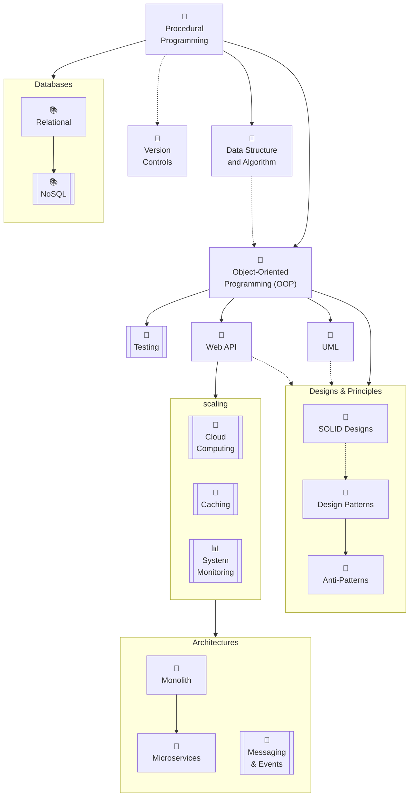

# {frontMatter.title}

<p>{frontMatter.description}</p>


<blockquote>ภาพจาก <a href={frontMatter.image} target="_blank">Microsoft Copilot</a></blockquote>

---

:::warning
แนวทางที่ป๋มนำมาแนะนำนี้ จะเป็นสายเดฟฝั่ง <Gray>Backend</Gray> และ <Gray>Architecture design</Gray> ซึ่งอาจไม่ใช่ตัวที่เหมาะกับทุกๆคน เพราะมันขึ้นอยู่กับ หน้างานที่เพื่อนๆได้รับ ความชอบความสนใจที่แต่ละคนมี บลาๆ ดังนั้นขอให้ดูแค่เป็นแนวทางนะกั๊ฟ ส่วนสายนี้เหมาะกับคนที่ชอบคิด ชอบเกมแก้ปัญหา ความสวยงามจะไม่สามารถมองเห็นได้ด้วยตา แต่สามารถสัมผัสได้ด้วยใจ 💓 จากการที่จิ๊กซอในระบบ มันเดินไปตามที่ออกแบบ ความเพลินของสายนี้คือการอ่านเกมให้ขาด
:::

## 🛸โพยการอัพสกิล {#roadmap}
เพื่อความง่ายในการเรียน **ดช.แมวน้ำ** จะขอคัดมาเฉพาะตัวที่เด็ดๆก่อน ไม่งั้นตาลายแน่นวล ส่วนรายละเอียดที่ขาดหายไป เดี๋ยวจะค่อยกลับมาเติมลงในเพจนี้เรื่อยๆฮั๊ฟ
> สำหรับวัยรุ่นใจฮ้อน สามารถดูภาพรวมได้จากลิงค์นี้เยย [`สมาคมโปรแกรมเมอร์ไทย 🎉`](https://roadmap.thaiprogrammer.org) ซึ่งเพื่อนๆสามารถเข้าไปช่วยแปลกันได้นะกั๊ฟจากตรงนี้ [Github](https://github.com/ThaiProgrammer/tpa-roadmap)

<details>
  <summary>(จิ้มอย่างแผ่วเบา) เพื่อดูความหมายของรูป</summary>
  <div>
    <div>
        ```mermaid
        flowchart
            Simple[เนื้อหาจบได้ด้วยตัวมันเอง]
            Complex[[มีรายละเอียดเยอะม๊วก\nแตกแขนงออกไปอีกหลายตัว]]
        ```
        ```mermaid
        flowchart
            A[A]-->AA[ต้องเรียน A ก่อน\nถึงจะเรียนก้อนนี้ได้]
            B[B]-.->BB["ไม่ต้องเรียน B ก็เรียนก้อนนี้ได้\n(ถ้าเรียนมาก่อนจะเข้าใจง่ายขึ้น)"]
        ```
        ```mermaid
        flowchart
            code[🤖\nการเขียนโค้ด]
            database[📚\nฐานข้อมูล]
            testing[🐞\nการทดสอบระบบ]
            utility[🔧\nตัวช่วย]
            design[🧩\nการออกแบบ]
            system[📊\nการดูแลระบบ]
            cloud[🚀\nคลาวด์]
        ```
    </div>
  </div>
</details>



## 😅ดูจบแล้วไงต่อ? {#whats-next}
เนื้อหาทั้งหมดทุกตัวใน Roadmap จะถูกเรียงหมวดตามสัญลักษณ์ต่างๆ (🤖📚🐞🔧🧩📊🚀) ซึ่งสามารถอ่านได้จากเว็บสลัดผักทั้งหมดเบย โดยกดที่เมนู [`🧑‍💻ฟามรู้`](/docs/category/contributions) ด้านบน หรือ จะแอบไปกดติดตามเพจสลัดผักไว้ก่อนก็ได้น้าา [`Facebook Mr.Saladpuk`](https://www.facebook.com/mr.saladpuk) ซึ่งในรอบนี้กระเป๋ม **ดช.แมวน้ำ** มีความตั้งใจที่จะค่อยๆทะยอยส่งมอบฟามรู้ให้กับเพื่อนๆอุ๊งๆของเรา และกำลังหาคนใจดีช่วยกันแชร์ความรู้ที่มีอยู่ในพุง โดยสามารถกดไปดูวิธีช่วยได้จากลิงค์นี่เบยกั๊ฟ [`🥳แบ่งปันฟามรู้`](/docs/contribute/creator)

:::note
เดี๋ยวถ้ามีเวลาจะกลับมาทำให้หน้านี้สามารถกดดูรายละเอียด และ พาเพื่อนๆไปยังบทความได้เลย รวมถึงระบบสมาชิกให้เพื่อนๆสามารถดูได้ว่ามีเนื้อหาไหนที่ยังไม่ได้ดู หรือ มีความรู้ตรงไหนอัพเดทใหม่ ให้จบเบ็ดเสร็จในหน้าเดียว แต่ตอนนี้ก็ยังไม่มีเวลาทำ ต้องขอโทษด้วยน้ากั๊ฟ 🙏
:::